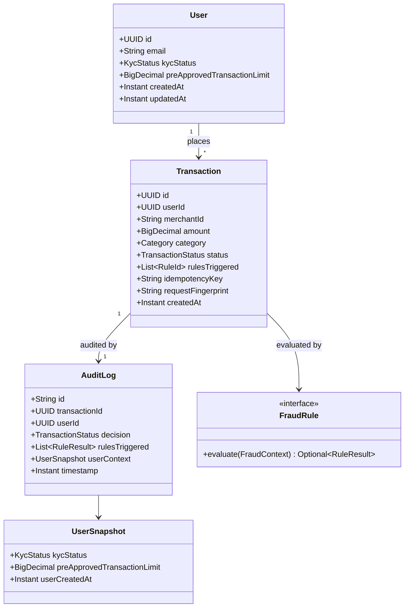

# Payment Processing System

## Overview

Spring Boot payment authorization service with an in-process fraud engine, durable PostgreSQL decisions (transaction + audit outbox), and asynchronous MongoDB audit projection. Challenge MVP (Phases 0–6): authorize → persist → return `APPROVED` / `FLAGGED` / `DECLINED` only after PostgreSQL commit.

**Core guarantee:** no business decision is returned unless the transaction **and** its audit outbox row were committed in PostgreSQL. Persistence unavailable → `503` — never fabricate a decline.

## Architecture

CQRS-lite on a single PostgreSQL system of record:

| Layer | Role |
| ----- | ---- |
| API | Controllers, `ApiResponse` envelope, Bean Validation, OpenAPI |
| Commands | Writes: `FOR UPDATE`, idempotency, fraud, persist + outbox |
| Queries | Read-only views (`GetUser`, `GetTransaction`, list users/transactions) |
| Domain | `User`, `Transaction`, `FraudEngine` + four `FraudRule`s |
| Data | JPA/Liquibase (Postgres), Mongo audit docs, `OutboxPublisher` |

```text
POST /transactions → ProcessTransactionHandler
  → SELECT user FOR UPDATE
  → FraudEngine (all rules)
  → INSERT transaction + audit_outbox (one PG txn)
  → 201 + business status
       ↓ async
  OutboxPublisher → Mongo audit_logs (_id = transactionId)
```

Design docs: [`docs/`](docs/) · plan: [`docs/plan.md`](docs/plan.md) · HLD: [`docs/high-level-design.md`](docs/high-level-design.md) · LLD: [`docs/low-level-design.md`](docs/low-level-design.md).

**Stack (this branch):** Java 21+, Spring Boot **3.5.16**, Maven, PostgreSQL 18, MongoDB 8, Liquibase, Testcontainers, JUnit 5, JaCoCo.

**Security posture:** Framework High/Critical CVEs that need **6.2.20+** are not fixable via Maven Central on Boot 3.x (commercial-only / EOL public line). This branch **virtually patches** those Spring Framework findings by non-use (MVC `@RestController` JSON only — no WebFlux, RSocket, WebMvc.fn, SSE, `XsltView`, or user SpEL) plus documented OWASP suppressions in `owasp-suppressions.xml`. Other High/Critical deps are upgraded in `pom.xml` (Tomcat 10.1.59, Netty 4.1.138, Jackson 2.21.6, PostgreSQL 42.7.13, swagger-ui 5.32.14, …). Prefer Boot **4.1.x** on `develop`/`main` when an OSS Framework upgrade is acceptable (cleaner SCA — library fixes instead of suppressions).

## Setup & Prerequisites

- Java 21+
- Maven 3.9+
- Docker + Docker Compose
- `jq` (for [`scripts/demo.sh`](scripts/demo.sh))

```bash
cp .env.example .env   # first time; .env is gitignored
```

## Running the Application

```bash
docker compose up --build -d
# wait until healthy, then:
curl -s http://localhost:8080/actuator/health/readiness
./scripts/demo.sh
```

| Service | Image |
| ------- | ----- |
| App | `Dockerfile` (Temurin 21) |
| PostgreSQL | `postgres:18-alpine` |
| MongoDB | `mongo:8` |

Ports and credentials come from `.env` (`APP_PORT` default `8080`). If you previously used Postgres ≤17 with this project, wipe volumes once: `docker compose down -v`.

**Local Maven (DB must be up):**

```bash
docker compose up -d postgres mongo
mvn -q -DskipTests package
# run PaymentProcessingApplication with .env (see IntelliJ EnvFile note below)
```

**OpenAPI / Swagger:** http://localhost:8080/swagger-ui.html · http://localhost:8080/v3/api-docs

**Manual API tests (Bruno):** collection in [`bruno/`](bruno/) — Desktop with env **Local**, or:

```bash
cd bruno && npx @usebruno/cli run --env Local
# or by folder: health | user | transaction
```

## API Endpoints

All responses use the `ApiResponse` envelope (`data`, `message`, `errors[]`, `meta.requestId`). Optional header: `X-Request-Id` (echoed + MDC). Optional on payments: `Idempotency-Key`.

### Users — `/api/v1/users`

| Method | Path | Success | Notes |
| ------ | ---- | ------- | ----- |
| `POST` | `/api/v1/users` | `201` | `{ "email", "kycStatus"? }` |
| `GET` | `/api/v1/users` | `200` | Cursor page (`limit`, `cursor`, optional `kycStatus`) |
| `GET` | `/api/v1/users/{id}` | `200` | `404` `USER_NOT_FOUND` |
| `PATCH` | `/api/v1/users/{id}` | `200` | KYC and/or `preApprovedTransactionLimit` |

### Transactions — `/api/v1/transactions`

| Method | Path | Success | Notes |
| ------ | ---- | ------- | ----- |
| `POST` | `/api/v1/transactions` | `201` | Body: `amount`, `userId`, `merchantId`, `category` — status in `data` even when `DECLINED` |
| `GET` | `/api/v1/transactions` | `200` | Cursor page (`userId` required; `limit`, `cursor`, optional `from`/`to`/`status`) |
| `GET` | `/api/v1/transactions/{id}` | `200` | `404` `NOT_FOUND` |

| Outcome | HTTP | Code |
| ------- | ---- | ---- |
| Processed | `201` | business status in `data` |
| Unknown user | `404` | `USER_NOT_FOUND` |
| Same key, different payload | `409` | `IDEMPOTENCY_CONFLICT` |
| Invalid body | `400` | `VALIDATION_ERROR` |
| PostgreSQL failure | `503` | `SERVICE_UNAVAILABLE` |
| Rate limit exceeded | `429` | `RATE_LIMIT_EXCEEDED` (+ optional `Retry-After`) |

### Fraud rules

| Rule | Condition | Outcome |
| ---- | --------- | ------- |
| `AMOUNT_WITHOUT_APPROVAL` | `amount > 10_000` and above pre-approved limit (`null`/`0` = none) | `DECLINE` |
| `VELOCITY` | ≥ 3 prior `APPROVED`/`FLAGGED` in inclusive `[now-60s, now]` | `DECLINE` |
| `HIGH_RISK_CATEGORY` | high-risk category and `amount > 5_000` | `DECLINE` |
| `NEW_USER_HIGH_AMOUNT` | `amount > 5_000` and user younger than 30 days | `FLAG` |

Aggregation: any `DECLINE` → `DECLINED`; else any `FLAG` → `FLAGGED`; else `APPROVED`.

### Ops

- Health: `/actuator/health`, `/actuator/health/liveness`, `/actuator/health/readiness` (readiness requires Postgres; Mongo is not required for readiness)
- Metrics: `/actuator/prometheus` (`payment_transactions_total`, `outbox_pending_count`, …)

### Quick curl sequence

Prefer [`scripts/demo.sh`](scripts/demo.sh). Minimal path:

```bash
USER_ID=$(curl -s -X POST http://localhost:8080/api/v1/users \
  -H 'Content-Type: application/json' \
  -d '{"email":"payer@example.com"}' | jq -r '.data.id')

curl -s -X POST http://localhost:8080/api/v1/transactions \
  -H 'Content-Type: application/json' \
  -H 'Idempotency-Key: demo-key-1' \
  -d "{\"amount\":100.00,\"userId\":\"$USER_ID\",\"merchantId\":\"mch_demo\",\"category\":\"GROCERIES\"}"
```

## Running Tests

```bash
mvn test          # unit + Testcontainers integration
mvn verify        # tests + JaCoCo report + ≥ 75% line coverage gate
```

Notable suites:

| Suite | What |
| ----- | ---- |
| `*Fraud*`, `*Rule*` | Domain fraud rules / aggregation (no Spring) |
| `TransactionApiTest`, `UserApiTest` | HTTP + Postgres Testcontainers |
| `ConcurrencyIT` | Rule 2 race (2 existing + 2 parallel) + concurrent idempotency |
| `OutboxPublisherIT` | Mongo projection, outage/recovery, duplicate `_id` |
| `WebhookOutboxIT` | Signed webhook delivery, 5xx retry, subscriber down |

Docker is required for Testcontainers. Security scanners (phase gate):

```bash
./scripts/check-security-docker-scout.sh
./scripts/check-security-owasp.sh   # needs NVD_API_KEY in .env
```

## Code Coverage

JaCoCo is bound to `mvn verify` (`prepare-agent`, `report`, `check`). Line coverage must be **≥ 75%** or the build fails (`jacoco.minimum.coverage` in `pom.xml`).

```bash
mvn verify
open target/site/jacoco/index.html
```

## Code quality (static analysis)

CI-oriented quality gate alongside JaCoCo. **No Sonar container in app `docker-compose`** and no runtime dependency.

| Path | Command | When |
| ---- | ------- | ---- |
| Local / CI gate | `mvn verify` | Tests + JaCoCo (≥ 75% line, ≥ 80% branch) + SpotBugs (High) + PMD + Checkstyle |
| SonarQube (optional) | `mvn verify sonar:sonar` | Needs a Sonar server + `SONAR_HOST_URL` / token (CI secrets) |

```bash
# Always-on local gate (no Sonar server required):
mvn verify
# Reports: target/site/jacoco/, target/spotbugsXml.xml, target/pmd.xml, target/checkstyle-result.xml

# Optional Sonar upload (after verify so JaCoCo XML exists):
export SONAR_HOST_URL=https://sonar.example.com
export SONAR_TOKEN=***   # never commit
mvn -B sonar:sonar -Dsonar.host.url="$SONAR_HOST_URL" -Dsonar.token="$SONAR_TOKEN"
```

**Quality expectations:** JaCoCo line ≥ 75% (enforced); SpotBugs fails on High findings; PMD/Checkstyle use lean configs under `config/`. Sample GitHub Actions workflow: [`.github/workflows/static-analysis.yml`](.github/workflows/static-analysis.yml) (runs `mvn verify`; Sonar step only when secrets are present).

## Design Decisions

Highlights from the [HLD](docs/high-level-design.md):

| Topic | Choice | Why |
| ----- | ------ | --- |
| Fraud rules | In-process `FraudRule` + `FraudEngine` | Unit-testable; Drools too heavy for four static rules |
| Commands vs queries | CQRS-lite, same Postgres | Clear write/read boundaries; authorize never uses a cache |
| Consistency | `SELECT … FOR UPDATE` on user row | Serializes Rule 2 velocity per user across app instances |
| Audit | Transactional outbox → async Mongo | Decision durable in PG; client never waits on Mongo |
| Why Mongo at all? | Separate audit projection | Demonstrates heterogeneous-store resilience; PG remains SoR |
| Idempotency | Optional key + SHA-256 fingerprint + partial unique index | Safe retries; `409` on fingerprint conflict |
| Rate limiting | In-process Bucket4j filter on `/api/v1/**` (user / merchant / IP) | Caps abuse before handlers; does **not** replace Rule 2 |
| Redis user cache | Optional `user:{id}` read-through on `GetUserHandler` only | Faster GETs; invalidate on PATCH; **never** on authorize `FOR UPDATE` |
| Bulk export | Cursor-paginated `GET /transactions?userId=` | Stable `created_at DESC, id DESC` pages; max limit 200; query-only |
| Webhooks | Outbox `WEBHOOK` + HMAC `X-Signature` | Async after commit; authorize never waits on subscriber HTTP |
| Static analysis | Sonar-ready JaCoCo + SpotBugs/PMD/Checkstyle on `verify` | CI quality gate; no Sonar in app Compose |
| Validation | Bean Validation on DTOs **and** handler guards | Contract at the edge; invariants for non-HTTP callers |
| Logging | SLF4J via `LogFactory` + Logback JSON + MDC | Never `System.out`; correlate via `requestId` |

**Authorize path:** load user with `FOR UPDATE` inside `ProcessTransactionHandler` — not via `GetUserHandler` or Redis.

**Optional Redis (Phase 8):**

```bash
# Core stack (no Redis):
docker compose up --build -d

# With query cache:
# in .env: PAYMENT_CACHE_USER_ENABLED=true
docker compose --profile redis up --build -d
# Repeated GET /api/v1/users/{id} → logs `user.cache.hit`; PATCH evicts `user:{id}`
# POST /transactions still uses SELECT … FOR UPDATE on PostgreSQL only
```

Config: `payment.cache.user.enabled` (default `false`), `ttl-seconds`, `spring.data.redis.*`. Redis down or disabled → GET users fall through to Postgres; readiness does not require Redis.

**Optional bulk export (Phase 9):**

```bash
# After creating a user and a few payments:
curl -s "http://localhost:8080/api/v1/transactions?userId=$USER_ID&limit=2"
# Follow data.nextCursor until hasMore is false
```

`ListTransactionsHandler` is read-only (no locks/outbox). Filters: required `userId`; optional `from`/`to` (inclusive ISO-8601), `status`, `cursor`; `limit` default 50, max 200.

**Optional webhooks (Phase 10):**

Disabled by default (`PAYMENT_WEBHOOKS_ENABLED=false`). When enabled, each payment commit also enqueues a `WEBHOOK` outbox row; `OutboxPublisher` POSTs signed JSON asynchronously (`X-Signature: sha256=…`). Authorize never waits on the subscriber. Subscribers must treat delivery as **at-least-once** and dedupe on `transactionId` (+ `event`).

### Webhook demo (local Compose → host listener)

**1. Start a fake subscriber on the host** (bind `0.0.0.0`, port `9999`):

```bash
python3 - <<'PY'
from http.server import BaseHTTPRequestHandler, HTTPServer
class H(BaseHTTPRequestHandler):
    def do_POST(self):
        n = int(self.headers.get("Content-Length", 0))
        body = self.rfile.read(n)
        print("X-Signature:", self.headers.get("X-Signature"))
        print("X-Request-Id:", self.headers.get("X-Request-Id"))
        print(body.decode())
        self.send_response(200); self.end_headers(); self.wfile.write(b"{}")
    def log_message(self, *a): pass
HTTPServer(("0.0.0.0", 9999), H).serve_forever()
PY
```

Confirm it is listening: `lsof -nP -iTCP:9999 -sTCP:LISTEN`

**2. Point the app at that listener** — sample subscriber in `application.yml`:

```yaml
payment:
  webhooks:
    enabled: true   # or PAYMENT_WEBHOOKS_ENABLED=true
    subscribers:
      - id: local
        merchant-id: "*"
        target-url: http://host.docker.internal:9999/hooks
        secret: change-me
        active: true
```

Use `host.docker.internal` (not `localhost`) so the **container** reaches the host. Compose maps that name via `extra_hosts: host.docker.internal:host-gateway`.

**3. Bring the stack up with webhooks on:**

```bash
# .env
PAYMENT_WEBHOOKS_ENABLED=true

docker compose up --build -d
# Optional reachability check from the app container:
docker compose exec app wget -S -qO- --timeout=3 http://host.docker.internal:9999/hooks || echo FAIL
```

**4. Happy path — signed delivery without slowing authorize:**

```bash
USER_ID=$(curl -s -X POST http://localhost:8080/api/v1/users \
  -H 'Content-Type: application/json' \
  -d '{"email":"wh-demo@example.com"}' | jq -r '.data.id')

time curl -s -X POST http://localhost:8080/api/v1/transactions \
  -H 'Content-Type: application/json' \
  -d "{\"userId\":\"$USER_ID\",\"merchantId\":\"mch_demo\",\"amount\":100.00,\"category\":\"GROCERIES\"}"
```

Expect HTTP **201** in tens of ms; the Python terminal prints body + `X-Signature: sha256=…`; outbox rows go `PUBLISHED`:

```bash
docker compose exec postgres psql -U payments -d payments -c \
  "SELECT destination, status, attempts FROM audit_outbox ORDER BY id DESC LIMIT 5;"
```

**5. Subscriber down — payment still 201, WEBHOOK retries:**

Stop the Python process (Ctrl+C), POST another transaction (still **201**), then:

```bash
docker compose exec postgres psql -U payments -d payments -c \
  "SELECT destination, status, attempts, left(last_error,80) AS err, next_attempt_at
   FROM audit_outbox WHERE destination='WEBHOOK' ORDER BY id DESC LIMIT 3;"
```

Expect `AUDIT` **PUBLISHED**, `WEBHOOK` **PENDING** with rising `attempts`. Restart the listener (and optionally `UPDATE audit_outbox SET next_attempt_at = now() WHERE destination='WEBHOOK' AND status='PENDING';`) — delivery resumes and the row becomes **PUBLISHED**.

Automated coverage: `mvn -Dtest=WebhookOutboxIT,WebhookClientTest test`.

**Rate limit demo (burst → 429):**

```bash
docker compose up --build -d   # required after pulling Phase 7 — old images have no RateLimitFilter
./scripts/demo-rate-limit.sh
```

Loops `POST /api/v1/transactions` for one `userId` until HTTP `429` + `RATE_LIMIT_EXCEEDED`, then confirms rejected calls do not insert `transactions` / `audit_outbox`. Defaults: `user` = 60/min (`payment.rate-limit.*` in `application.yml`; set `enabled: false` to disable).

## Domain UML

See also [`docs/uml-domain.md`](docs/uml-domain.md).



## IntelliJ: debug with `.env`

1. Install **EnvFile** (Borys Pierov), restart IDE  
2. Run/debug config for `PaymentProcessingApplication` → enable EnvFile → project `.env`  
3. Start Postgres/Mongo: `docker compose up -d postgres mongo`

## Docs index

| Doc | Purpose |
| --- | ------- |
| [docs/README.md](docs/README.md) | Design index |
| [docs/plan.md](docs/plan.md) | Phased implementation plan |
| [docs/high-level-design.md](docs/high-level-design.md) | Architecture & trade-offs |
| [docs/low-level-design.md](docs/low-level-design.md) | Schema, API, fraud, testing |
| [docs/uml-domain.md](docs/uml-domain.md) | Domain class diagram |
| [docs/Payment_Processing_Code_Challenge.md](docs/Payment_Processing_Code_Challenge.md) | Challenge brief |
