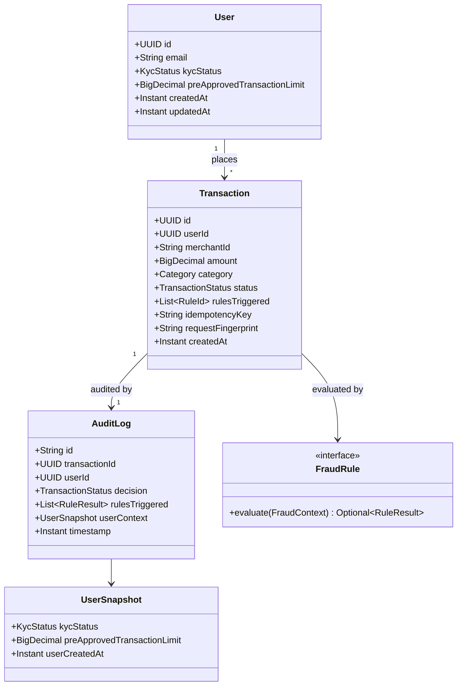

# Payment Processing System

## Overview

Spring Boot payment authorization service with an in-process fraud engine, durable PostgreSQL decisions (transaction + audit outbox), and asynchronous MongoDB audit projection. Challenge MVP (Phases 0–6): authorize → persist → return `APPROVED` / `FLAGGED` / `DECLINED` only after PostgreSQL commit.

**Core guarantee:** no business decision is returned unless the transaction **and** its audit outbox row were committed in PostgreSQL. Persistence unavailable → `503` — never fabricate a decline.

## Architecture

CQRS-lite on a single PostgreSQL system of record:

| Layer | Role |
| ----- | ---- |
| API | Controllers, `ApiResponse` envelope, Bean Validation, OpenAPI |
| Commands | Writes: `FOR UPDATE`, idempotency, fraud, persist + outbox |
| Queries | Read-only views (`GetUser`, `GetTransaction`, list users) |
| Domain | `User`, `Transaction`, `FraudEngine` + four `FraudRule`s |
| Data | JPA/Liquibase (Postgres), Mongo audit docs, `OutboxPublisher` |

```text
POST /transactions → ProcessTransactionHandler
  → SELECT user FOR UPDATE
  → FraudEngine (all rules)
  → INSERT transaction + audit_outbox (one PG txn)
  → 201 + business status
       ↓ async
  OutboxPublisher → Mongo audit_logs (_id = transactionId)
```

Design docs: [`docs/`](docs/) · plan: [`docs/plan.md`](docs/plan.md) · HLD: [`docs/high-level-design.md`](docs/high-level-design.md) · LLD: [`docs/low-level-design.md`](docs/low-level-design.md).

**Stack:** Java 21+, Spring Boot **4.1.1**, Maven, PostgreSQL 18, MongoDB 8, Liquibase, Testcontainers, JUnit 5, JaCoCo. Boot 4 is used only because Spring Framework High/Critical CVEs have no OSS 6.2.x fix on Maven Central (see `docs/plan.md`).

## Setup & Prerequisites

- Java 21+
- Maven 3.9+
- Docker + Docker Compose
- `jq` (for [`scripts/demo.sh`](scripts/demo.sh))

```bash
cp .env.example .env   # first time; .env is gitignored
```

## Running the Application

```bash
docker compose up --build -d
# wait until healthy, then:
curl -s http://localhost:8080/actuator/health/readiness
./scripts/demo.sh
```

| Service | Image |
| ------- | ----- |
| App | `Dockerfile` (Temurin 21) |
| PostgreSQL | `postgres:18-alpine` |
| MongoDB | `mongo:8` |

Ports and credentials come from `.env` (`APP_PORT` default `8080`). If you previously used Postgres ≤17 with this project, wipe volumes once: `docker compose down -v`.

**Local Maven (DB must be up):**

```bash
docker compose up -d postgres mongo
mvn -q -DskipTests package
# run PaymentProcessingApplication with .env (see IntelliJ EnvFile note below)
```

**OpenAPI / Swagger:** http://localhost:8080/swagger-ui.html · http://localhost:8080/v3/api-docs

**Manual API tests (Bruno):** collection in [`bruno/`](bruno/) — Desktop with env **Local**, or:

```bash
cd bruno && npx @usebruno/cli run --env Local
# or by folder: health | user | transaction
```

## API Endpoints

All responses use the `ApiResponse` envelope (`data`, `message`, `errors[]`, `meta.requestId`). Optional header: `X-Request-Id` (echoed + MDC). Optional on payments: `Idempotency-Key`.

### Users — `/api/v1/users`

| Method | Path | Success | Notes |
| ------ | ---- | ------- | ----- |
| `POST` | `/api/v1/users` | `201` | `{ "email", "kycStatus"? }` |
| `GET` | `/api/v1/users` | `200` | Cursor page (`limit`, `cursor`, optional `kycStatus`) |
| `GET` | `/api/v1/users/{id}` | `200` | `404` `USER_NOT_FOUND` |
| `PATCH` | `/api/v1/users/{id}` | `200` | KYC and/or `preApprovedTransactionLimit` |

### Transactions — `/api/v1/transactions`

| Method | Path | Success | Notes |
| ------ | ---- | ------- | ----- |
| `POST` | `/api/v1/transactions` | `201` | Body: `amount`, `userId`, `merchantId`, `category` — status in `data` even when `DECLINED` |
| `GET` | `/api/v1/transactions/{id}` | `200` | `404` `NOT_FOUND` |

| Outcome | HTTP | Code |
| ------- | ---- | ---- |
| Processed | `201` | business status in `data` |
| Unknown user | `404` | `USER_NOT_FOUND` |
| Same key, different payload | `409` | `IDEMPOTENCY_CONFLICT` |
| Invalid body | `400` | `VALIDATION_ERROR` |
| PostgreSQL failure | `503` | `SERVICE_UNAVAILABLE` |
| Rate limit exceeded | `429` | `RATE_LIMIT_EXCEEDED` (+ optional `Retry-After`) |

### Fraud rules

| Rule | Condition | Outcome |
| ---- | --------- | ------- |
| `AMOUNT_WITHOUT_APPROVAL` | `amount > 10_000` and above pre-approved limit (`null`/`0` = none) | `DECLINE` |
| `VELOCITY` | ≥ 3 prior `APPROVED`/`FLAGGED` in inclusive `[now-60s, now]` | `DECLINE` |
| `HIGH_RISK_CATEGORY` | high-risk category and `amount > 5_000` | `DECLINE` |
| `NEW_USER_HIGH_AMOUNT` | `amount > 5_000` and user younger than 30 days | `FLAG` |

Aggregation: any `DECLINE` → `DECLINED`; else any `FLAG` → `FLAGGED`; else `APPROVED`.

### Ops

- Health: `/actuator/health`, `/actuator/health/liveness`, `/actuator/health/readiness` (readiness requires Postgres; Mongo is not required for readiness)
- Metrics: `/actuator/prometheus` (`payment_transactions_total`, `outbox_pending_count`, …)

### Quick curl sequence

Prefer [`scripts/demo.sh`](scripts/demo.sh). Minimal path:

```bash
USER_ID=$(curl -s -X POST http://localhost:8080/api/v1/users \
  -H 'Content-Type: application/json' \
  -d '{"email":"payer@example.com"}' | jq -r '.data.id')

curl -s -X POST http://localhost:8080/api/v1/transactions \
  -H 'Content-Type: application/json' \
  -H 'Idempotency-Key: demo-key-1' \
  -d "{\"amount\":100.00,\"userId\":\"$USER_ID\",\"merchantId\":\"mch_demo\",\"category\":\"GROCERIES\"}"
```

## Running Tests

```bash
mvn test          # unit + Testcontainers integration
mvn verify        # tests + JaCoCo report + ≥ 75% line coverage gate
```

Notable suites:

| Suite | What |
| ----- | ---- |
| `*Fraud*`, `*Rule*` | Domain fraud rules / aggregation (no Spring) |
| `TransactionApiTest`, `UserApiTest` | HTTP + Postgres Testcontainers |
| `ConcurrencyIT` | Rule 2 race (2 existing + 2 parallel) + concurrent idempotency |
| `OutboxPublisherIT` | Mongo projection, outage/recovery, duplicate `_id` |

Docker is required for Testcontainers. Security scanners (phase gate):

```bash
./scripts/check-security-docker-scout.sh
./scripts/check-security-owasp.sh   # needs NVD_API_KEY in .env
```

## Code Coverage

JaCoCo is bound to `mvn verify` (`prepare-agent`, `report`, `check`). Line coverage must be **≥ 75%** or the build fails (`jacoco.minimum.coverage` in `pom.xml`).

```bash
mvn verify
open target/site/jacoco/index.html
```

## Design Decisions

Highlights from the [HLD](docs/high-level-design.md):

| Topic | Choice | Why |
| ----- | ------ | --- |
| Fraud rules | In-process `FraudRule` + `FraudEngine` | Unit-testable; Drools too heavy for four static rules |
| Commands vs queries | CQRS-lite, same Postgres | Clear write/read boundaries; authorize never uses a cache |
| Consistency | `SELECT … FOR UPDATE` on user row | Serializes Rule 2 velocity per user across app instances |
| Audit | Transactional outbox → async Mongo | Decision durable in PG; client never waits on Mongo |
| Why Mongo at all? | Separate audit projection | Demonstrates heterogeneous-store resilience; PG remains SoR |
| Idempotency | Optional key + SHA-256 fingerprint + partial unique index | Safe retries; `409` on fingerprint conflict |
| Rate limiting | In-process Bucket4j filter on `/api/v1/**` (user / merchant / IP) | Caps abuse before handlers; does **not** replace Rule 2 |
| Validation | Bean Validation on DTOs **and** handler guards | Contract at the edge; invariants for non-HTTP callers |
| Logging | SLF4J via `LogFactory` + Logback JSON + MDC | Never `System.out`; correlate via `requestId` |

**Authorize path:** load user with `FOR UPDATE` inside `ProcessTransactionHandler` — not via `GetUserHandler`.

**Rate limit demo (burst → 429):** with defaults (`user` = 60/min), temporarily lower limits or loop `POST /transactions` for one `userId` until HTTP `429` with `RATE_LIMIT_EXCEEDED`. Over-limit requests never insert `transactions` or `audit_outbox`. Config: `payment.rate-limit.*` in `application.yml` (set `enabled: false` to disable).

## Domain UML

See also [`docs/uml-domain.md`](docs/uml-domain.md).



## IntelliJ: debug with `.env`

1. Install **EnvFile** (Borys Pierov), restart IDE  
2. Run/debug config for `PaymentProcessingApplication` → enable EnvFile → project `.env`  
3. Start Postgres/Mongo: `docker compose up -d postgres mongo`

## Docs index

| Doc | Purpose |
| --- | ------- |
| [docs/README.md](docs/README.md) | Design index |
| [docs/plan.md](docs/plan.md) | Phased implementation plan |
| [docs/high-level-design.md](docs/high-level-design.md) | Architecture & trade-offs |
| [docs/low-level-design.md](docs/low-level-design.md) | Schema, API, fraud, testing |
| [docs/uml-domain.md](docs/uml-domain.md) | Domain class diagram |
| [docs/Payment_Processing_Code_Challenge.md](docs/Payment_Processing_Code_Challenge.md) | Challenge brief |
