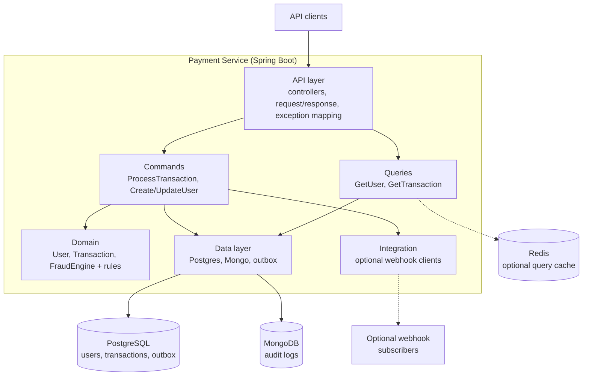
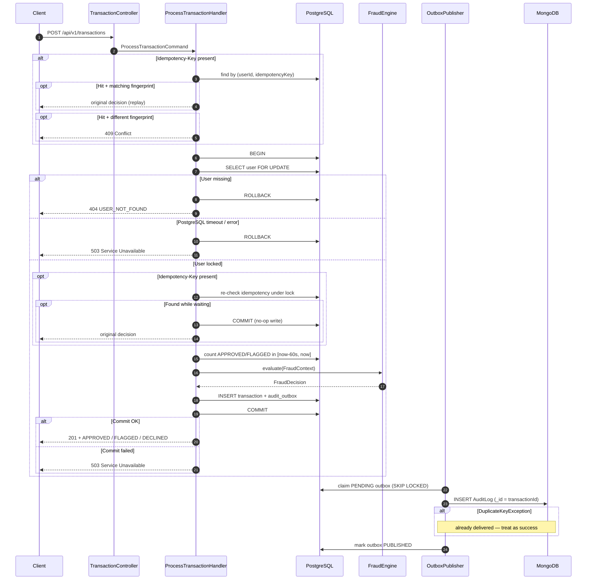
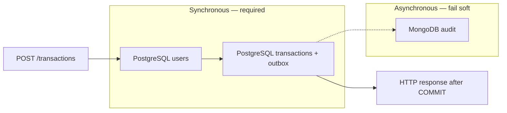
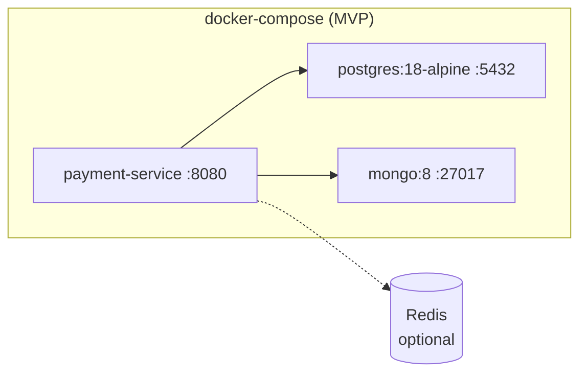

# High-Level Design

> **Docs index:** [README.md](README.md) · [requirements-and-assumptions.md](requirements-and-assumptions.md) · [high-level-design.md](high-level-design.md) · [low-level-design.md](low-level-design.md)

This document describes the overall architecture, packaging (CQRS-lite), request flow, key design decisions, resilience posture, deployment topology, and how optional enhancements plug in.

See [requirements-and-assumptions.md](requirements-and-assumptions.md) for goals and assumptions, and [low-level-design.md](low-level-design.md) for schemas, API contracts, fraud rule details, testing, and build order.

**Core guarantee:** No transaction decision is acknowledged to the client unless the transaction and its audit intent have been durably committed to PostgreSQL.

```text
APPROVED response  → durable APPROVED transaction exists
FLAGGED response   → durable FLAGGED transaction exists
DECLINED response  → durable DECLINED transaction exists
Persistence unavailable → no business decision acknowledged → 503 Service Unavailable
```

---

## High-Level Architecture

The product is one bounded context: **payment authorization with fraud screening**. It is deployed as one Spring Boot application plus two data stores.



Dashed edges are **optional enhancements** (Redis read cache, webhook delivery). The solid path is MVP.


### Main components


| Component               | Responsibility                                                                                                                                  |
| ----------------------- | ----------------------------------------------------------------------------------------------------------------------------------------------- |
| **API layer**           | HTTP contracts, request/response DTOs, status-code mapping, OpenAPI. Maps each endpoint to one command or query handler. No business rules.   |
| **Commands**            | Write use cases: idempotency, locking, load data, call domain, persist, return result **after commit**.                                         |
| **Queries**             | Read-only use cases: fetch user/transaction views. No locks, no side effects. May later use cache/replica.                                      |
| **Domain**              | Business concepts and policies (`User`, `Transaction`, `FraudEngine` / rules). No HTTP, JPA, or Mongo types.                                    |
| **Data layer**          | Database-specific entities, repositories, and outbox publisher.                                                                                 |
| **Integration**         | Outbound third-party clients. Empty for MVP; optional webhook HTTP client when notifications are enabled.                                       |
| **PostgreSQL**          | Source of truth for users and transactions. Also holds the **outbox** (audit today; optional webhook destinations later).                       |
| **MongoDB**             | Query-optimized, append-only audit collection. Eventually consistent with PostgreSQL.                                                           |
| **Outbox publisher**    | Background worker that ships committed outbox rows to Mongo and retries on failure (`FOR UPDATE SKIP LOCKED`). May later deliver webhook rows.  |
| **Redis (optional)**    | Query-side cache only (`GetUserHandler`, optional fraud-config TTL). Never on the authorize / `FOR UPDATE` path.                                |
| **Resilience**          | Timeouts and circuit breakers around Mongo (and optional Redis/webhooks). PostgreSQL failures surface as `503`.                                 |


PostgreSQL is the **system of record**. MongoDB is an **audit projection**. A decision is durable as soon as the PostgreSQL transaction commits, even if Mongo is unavailable.

**Why MongoDB at all?** PostgreSQL alone could store both transactions and audit records atomically and would be simpler for this scope. MongoDB is deliberately used as a separate audit projection to demonstrate resilience and consistency across heterogeneous stores. PostgreSQL remains authoritative through the transactional outbox.

---

## Layered Design (Inside the Service)

### Project identity

| Item | Value |
| ---- | ----- |
| Application name | `payment-processing-system` |
| Maven `groupId` | `com.example` |
| Maven `artifactId` | `payment-processing-system` |
| Base Java package | `com.example.payment` |
| Main class | `com.example.payment.PaymentProcessingApplication` |

Spring Boot module layout uses base package `com.example.payment`. Subpackages (`api`, `service`, `domain`, `data`, …) hang under that root.

Layered packages sized for this challenge, with **application-level CQRS-lite**: controllers call command or query handlers; the same PostgreSQL/Mongo stores remain underneath. No separate read database, no mediator bus. Interfaces exist where they protect boundaries — especially replaceable or failure-prone adapters (e.g. audit publish) — not for every class.

```
com.example.payment
│
├── api
│   ├── controller
│   ├── request
│   ├── response
│   │   ├── ApiResponse.java
│   │   ├── ApiError.java
│   │   ├── ApiMeta.java
│   │   ├── TransactionResponse.java
│   │   └── UserResponse.java
│   └── exception
│       └── GlobalExceptionHandler.java
│
├── service
│   ├── command
│   │   ├── ProcessTransactionHandler.java
│   │   ├── CreateUserHandler.java
│   │   └── UpdateUserHandler.java
│   ├── query
│   │   ├── GetUserHandler.java
│   │   ├── ListUsersHandler.java
│   │   └── GetTransactionHandler.java
│   └── mapper
│
├── domain
│   ├── transaction
│   │   ├── Transaction.java
│   │   └── TransactionStatus.java
│   │
│   ├── user
│   │   ├── User.java
│   │   └── KycStatus.java
│   │
│   └── fraud
│       ├── FraudEngine.java
│       ├── FraudRule.java
│       ├── FraudContext.java
│       ├── FraudDecision.java
│       ├── RuleResult.java
│       ├── RuleId.java
│       ├── Severity.java
│       ├── Category.java
│       └── rule
│           ├── AmountWithoutApprovalRule.java
│           ├── VelocityRule.java
│           ├── HighRiskCategoryRule.java
│           └── NewUserHighAmountRule.java
│
├── data
│   ├── postgres
│   │   ├── entity
│   │   └── repository
│   │
│   ├── mongo
│   │   ├── document
│   │   └── repository
│   │
│   └── outbox
│       └── OutboxPublisher.java
│
├── integration
│   └── [optional webhook HTTP client]
│
├── config
│   ├── ClockConfig.java
│   ├── FraudProperties.java
│   └── OpenApiConfig.java
│
└── common
    ├── exception
    ├── logging
    │   └── LogFactory.java
    └── util
```

Optional later packages (not required for MVP): `api.filter` (rate limiting), `data.redis` (query cache), additional query handlers for bulk export.

### Why this organization

| Package | Answers | Contains |
| ------- | ------- | -------- |
| `api` | How do clients talk to us? | Controllers, request DTOs (**Bean Validation**), standard `ApiResponse` envelope, `GlobalExceptionHandler` |
| `service.command` | How do we mutate state for a use case? | Write handlers: business validation, locks, domain calls, persistence, outbox |
| `service.query` | How do we read state for a use case? | Read-only handlers: no locks, no side effects; still guard invalid ids |
| `domain` | What are the business concepts and rules? | Models, enums, fraud engine and rules |
| `data` | How do we store and retrieve state? | Postgres/Mongo entities, repositories, outbox |
| `integration` | How do we talk to systems we don’t own? | External clients (webhooks, etc.) when needed |
| `config` | How is the framework wired? | Spring beans, typed properties, OpenAPI |
| `common` | What is truly cross-cutting? | Shared exceptions, **`LogFactory`**, utils — **not** business enums |

Business enums (`TransactionStatus`, `KycStatus`, `Category`, …) live next to their domain, not in a generic `constants` package. Thresholds and toggles live in `config` (`FraudProperties`), not scattered magic numbers.

**Dependency rule:** `api` → `service` → `domain`. Commands depend on `data` / `integration` for I/O. Queries depend on `data` for reads only. `domain` has no Spring, JDBC, or Mongo types. Prefer interfaces over inheritance; do not introduce abstract base classes unless subclasses share real invariant behavior.

### CQRS-lite (application level, same database)

User profile **writes** are rare; **reads** happen on every payment and on `GET /users`. That asymmetry motivates separating command and query handlers — not a second database.

| HTTP | Handler | Kind |
| ---- | ------- | ---- |
| `POST /api/v1/transactions` | `ProcessTransactionHandler` | Command |
| `POST /api/v1/users` | `CreateUserHandler` | Command |
| `GET /api/v1/users` | `ListUsersHandler` | Query |
| `PATCH /api/v1/users/{id}` | `UpdateUserHandler` | Command |
| `GET /api/v1/users/{id}` | `GetUserHandler` | Query |
| `GET /api/v1/transactions/{id}` | `GetTransactionHandler` | Query |
| `GET /api/v1/transactions` (optional) | `ListTransactionsHandler` | Query |

**Rules:**

- Commands own `@Transactional` writes, idempotency, and row locks.
- Queries are read-only; they must not acquire `FOR UPDATE` or write outbox rows.
- Same Postgres primary today. Queries may later use cache or a read replica; commands always use the primary.

**Critical:** the user load inside `ProcessTransactionHandler` is **not** routed through `GetUserHandler`. Authorization requires:

```text
SELECT … FOR UPDATE  (same PG transaction as velocity count + insert + outbox)
```

That read is uncacheable. Caching (if added later) applies only to query handlers such as `GetUserHandler`. After `UpdateUserHandler`, evict any `user:{id}` cache entry so GETs see fresh data. Payment never trusts the cache.

```text
GetUserHandler              → optional cache → DB (read-only)
ProcessTransactionHandler   → userRepository.findByIdForUpdate()  // primary only
UpdateUserHandler           → DB write → invalidate cache key
```

### Why separate `service` and `domain` (orchestration)

They answer different questions:

- **`domain`** — *What* are the business concepts and rules?
- **`service.command`** — *In what order* do we coordinate those rules, repositories, locks, and integrations to finish a write use case?
- **`service.query`** — *How* do we expose a read model without side effects?

That write-side coordination is **orchestration**.

Domain logic is policy, for example:

```text
if recentTransactionCount >= 3 → DECLINED
if highRiskCategory && amount > 5000 → DECLINED
```

Those rules must not know HTTP, JPA, Mongo, row locks, `@Transactional`, or repositories. They live under `domain/fraud`.

`ProcessTransactionHandler` coordinates the write use case:

```text
check idempotency
    ↓
lock user row
    ↓
load user
    ↓
count recent transactions
    ↓
call FraudEngine
    ↓
create transaction
    ↓
save transaction
    ↓
save audit outbox
    ↓
return result
```

Simplified shape:

```java
@Service
public class ProcessTransactionHandler {

    private final UserRepository userRepository;
    private final TransactionRepository transactionRepository;
    private final FraudEngine fraudEngine;
    private final AuditOutboxRepository outboxRepository;

    @Transactional
    public TransactionResult handle(ProcessTransactionCommand command) {
        User user = userRepository
                .findByIdForUpdate(command.userId())
                .orElseThrow(UserNotFoundException::new);

        long recentCount = transactionRepository.countRecentSuccessful(...);

        FraudContext context = new FraudContext(
                user, command.amount(), command.category(), recentCount);

        FraudDecision decision = fraudEngine.evaluate(context);

        Transaction transaction = Transaction.create(command, decision);
        transactionRepository.save(transaction);
        outboxRepository.save(AuditEvent.from(transaction, user, decision));

        return TransactionResult.from(transaction);
    }
}
```

The handler does **not** decide “amount > 5000 means X.” It gathers data, asks the domain to decide, then persists. Analogy: the command handler is the conductor; `FraudRule` classes are the performers; repositories are persistence collaborators.

**Change isolation:**

| Change | Touch |
| ------ | ----- |
| Rule 2 threshold 3 → 5 | `VelocityRule` (+ its unit tests) |
| Audit sync to Postgres instead of Mongo/outbox | Command / `data` path |
| Cache `GET /users` | `GetUserHandler` (+ invalidation on update) only |
| HTTP status mapping | `api` only |

Fraud rules stay unit-testable with plain objects and a fixed `Clock` — no Spring context, no database, no mocks of persistence.

### Scale note

For a much larger system, package-by-feature (`transaction/`, `user/`, `audit/`, each with its own api/service/data) can scale better. For this coding challenge, layered packages plus CQRS-lite handlers are easier to review and entirely appropriate. A separate read database or Redis on the authorize path is **out of scope**; CQRS-lite only keeps the door open for query-side optimization later.

---

## Request Flow — Process Transaction




### Processing steps (happy path)

1. Validate payload at the API edge (Bean Validation on request DTOs) and re-check business guards in the command handler (amount > 0, required IDs, known category).
2. If an idempotency key is present, look up by `(userId, key)`. Matching fingerprint → return stored result. Different fingerprint → `409`.
3. `BEGIN` a PostgreSQL transaction.
4. `SELECT * FROM users WHERE id = :userId FOR UPDATE` — serialization point for that user.
5. Re-check idempotency under the lock (another request may have inserted while waiting).
6. Query velocity: count `APPROVED`/`FLAGGED` in the sliding window `[now - 60s, now]`.
7. Build `FraudContext` and evaluate **all** fraud rules.
8. Insert `transactions` and `audit_outbox` in the **same** transaction.
9. `COMMIT`. Only then return `201` with the business `status`.
10. If commit fails → `ROLLBACK` → `503`. No decision is acknowledged.
11. The publisher writes the audit document to Mongo asynchronously.


### Transaction boundary

```text
BEGIN
  ↓
SELECT user FOR UPDATE
  ↓
Load authoritative user data
  ↓
Re-check idempotency
  ↓
Query APPROVED/FLAGGED in [now - 60s, now]
  ↓
Evaluate fraud rules
  ↓
Insert transaction
  ↓
Insert audit outbox
  ↓
COMMIT
  ↓
Return APPROVED / FLAGGED / DECLINED
```

The `FOR UPDATE` lock is held until commit or rollback, so another request for the same user cannot run the velocity check before the previous transaction is visible.

### Decision acknowledgement

```text
Evaluate fraud decision
        ↓
Persist transaction
        ↓
Persist audit outbox
        ↓
COMMIT PostgreSQL transaction
        ↓
Return APPROVED / FLAGGED / DECLINED
```

If the PostgreSQL commit fails:

```text
ROLLBACK
   ↓
503 Service Unavailable
```

The client is not blocked on Mongo. Audit intent cannot disappear on restart because it lives in `audit_outbox` until Mongo ACK.

---

## Design Decisions and Trade-offs


### Where fraud rules live

**Choice:** In-process strategy objects behind `FraudEngine`. One class per rule; interface only — no unnecessary abstract base classes.


| Option                             | Pros                                    | Cons                                      |
| ---------------------------------- | --------------------------------------- | ----------------------------------------- |
| `if`/`else` in the command handler | Fast to write                           | Untestable in isolation; composition bugs |
| Rules engine (Drools, etc.)        | Hot-reload policies                     | Heavy for four static rules               |
| **Java** `FraudRule` **+ engine**  | Unit-testable, explicit, easy to extend | Code change to add a rule                 |


### CQRS-lite (commands vs queries)

**Choice:** Application-level CQRS-lite — separate command and query handlers, **same** PostgreSQL (and Mongo audit projection). No separate read DB, no mediator framework.


| Option | Pros | Cons |
| ------ | ---- | ---- |
| Single `UserService` / `TransactionService` | Familiar, fewer types | Read and write concerns grow tangled |
| Full CQRS (separate read DB / projections) | Independent read scale | Far too heavy for this challenge; breaks simple `FOR UPDATE` story |
| **CQRS-lite handlers** | Clear write vs read boundaries; query side ready for cache/replica later | Slightly more packages |

**Authorize path stays strongly consistent:** `ProcessTransactionHandler` loads the user with `SELECT … FOR UPDATE` on the primary inside its transaction. It does **not** call `GetUserHandler` or a cache. Optional caching applies only to query handlers (`GetUserHandler`), with invalidation on `UpdateUserHandler`.

### Request validation (DTO + handler)

**Choice:** Layered validation — Jakarta Bean Validation on API request DTOs **and** business guards in CQRS-lite handlers.

| Approach | Pros | Cons |
| -------- | ---- | ---- |
| DTO-only | Fast HTTP 400 with field paths; matches REST contract | Bypassed if handlers are called outside HTTP |
| Handler-only | Protects all entry points | Weak HTTP field mapping; inconsistent envelopes |
| **Both (chosen)** | Contract at the edge; invariants in the use case | Must not duplicate the *same* rule in both layers |

**Rule of thumb:** formats and presence → DTO annotations + `@Valid`. Uniqueness, not-found, and domain invariants → handlers (mapped by `GlobalExceptionHandler` to the `ApiResponse` envelope). Details: LLD *Request validation (layered)*.

### Audit: sync vs async

**Choice:** **Transactional outbox** — synchronous durability in PostgreSQL, asynchronous projection to MongoDB.


| Option                             | Durability              | Latency               | Failure mode                                            |
| ---------------------------------- | ----------------------- | --------------------- | ------------------------------------------------------- |
| Sync write to Mongo in the request | Strong if both succeed  | Client waits on Mongo | Dual-write: PG committed, Mongo failed (or the reverse) |
| Fire-and-forget to Mongo           | Weak                    | Fast                  | Lost on crash before send                               |
| **Outbox in the PG transaction**   | Strong for the decision | Fast for the client   | Mongo lags; publisher retries                           |


Mongo is **not** on the synchronous authorization path:

```text
Transaction request
       ↓
PostgreSQL transaction + outbox
       ↓
COMMIT
       ↓
Return business decision

Mongo publishing occurs asynchronously
```

If MongoDB is unavailable: processing continues, outbox stays `PENDING`, publisher retries, audit is eventually inserted. No transaction data or audit intent is lost.

### Concurrency and Rule 2

**Race:** two concurrent payments for the same user both read `count = 2`, both approve → four authorized payments in 60 seconds.

**Choice:** `SELECT * FROM users WHERE id = :userId FOR UPDATE` held for the entire velocity + insert transaction.

- Serializes only **that user**. Other users proceed in parallel.
- Lock is transaction-scoped; releases on commit/rollback.
- Works across multiple app instances sharing one Postgres.
- An application-level mutex is **not** enough across instances.

Idempotency is a separate unique constraint, not a substitute for the velocity lock.

### Consistency between PostgreSQL and MongoDB

This is **at-least-once, eventually consistent** replication:

1. PG commit is atomic (transaction + outbox).
2. Publisher **inserts** Mongo with `_id = transactionId`, then marks `PUBLISHED`.
3. Crash between Mongo insert and outbox update → retry; `DuplicateKeyException` → already delivered → mark `PUBLISHED`.
4. Crash before Mongo write → retry from outbox; no silent loss.

There is no two-phase commit. We accept a short window where PG is ahead of Mongo.

### Outbox publisher

**Multi-instance safety** — claim rows with:

```sql
SELECT *
FROM audit_outbox
WHERE status = 'PENDING'
  AND next_attempt_at <= now()
ORDER BY id
FOR UPDATE SKIP LOCKED
LIMIT :batchSize;
```

Workers process disjoint batches without blocking each other.

**Retry policy** — persistent retries with configurable exponential backoff (example: immediate, +2s, +5s, +10s, +30s, …). After repeated failures: retain the event, increase intervals, emit metrics, alert ops. Never silently discard.

### Resilience and graceful degradation




| Dependency                | Policy                                                                                                                                                        |
| ------------------------- | ------------------------------------------------------------------------------------------------------------------------------------------------------------- |
| PostgreSQL (users / txns) | JDBC timeout (e.g. 2s). If user load or commit fails: `503`. No fabricated `DECLINED`. Nothing acknowledged unless committed.                                 |
| MongoDB                   | Not on the request path. Publisher: timeout, circuit breaker (Resilience4j), exponential backoff. Circuit open → skip poll briefly, outbox remains `PENDING`. |
| Process crash             | In-flight HTTP may return 5xx; if PG committed, the decision and outbox are intact. Client retries with the same idempotency key.                             |


---

## Deployment Topology




- One `docker-compose.yml`: app, **PostgreSQL 18**, **MongoDB 8**.
- Postgres volume mounts `/var/lib/postgresql` (PG 18+ image layout). Major-version bumps need a fresh volume (`docker compose down -v`) or a proper `pg_upgrade` / dump-restore.
- App waits for PG via healthchecks, then **Liquibase** migrations, then starts.
- Outbox publisher is a `@Scheduled` worker **inside** the app (safe across instances via `SKIP LOCKED`).
- Optional Redis (query cache / shared rate-limit buckets) is a later compose service — not required for MVP.

**Out of scope for this challenge:** Kafka / Zookeeper / KRaft, Redis for velocity or distributed locks (optional read-through cache on `GetUserHandler` only is a later enhancement), microservices, Drools, event sourcing, separate fraud or audit services, separate read database for CQRS. PostgreSQL outbox + scheduled publisher is sufficient. Kafka could be introduced later for many downstream consumers; Redis on the authorize path would add consistency concerns without being necessary for Rule 2.

---

## Optional Enhancements (architecture)

See [requirements-and-assumptions.md](requirements-and-assumptions.md) for status/intent/non-goals, and [low-level-design.md](low-level-design.md) for contracts. This section describes how each enhancement plugs into the architecture **without changing the core guarantee**.

### Idempotency keys — already core

Idempotency is part of the MVP authorize path (`Idempotency-Key`, fingerprint, unique partial index, double-check under the user lock). It is listed in the challenge’s optional section but is **already designed and required** in this system. See [Request Flow](#request-flow--process-transaction) and LLD Idempotency.

### Webhook / notification system

**Problem:** Merchants or internal systems need push notification when a transaction is decided, without polling.

**Fit:** Reuse the transactional outbox. After `COMMIT`, durability already includes audit intent; the same pattern can enqueue a second outbox destination.

```text
POST /transactions
       ↓
PG transaction: insert txn + outbox(AUDIT) [+ optional outbox(WEBHOOK)]
       ↓
COMMIT → return 201
       ↓
Publisher (async):
  AUDIT   → Mongo insert
  WEBHOOK → HTTP POST to subscriber (HMAC-signed) with retry/backoff
```

| Concern | Choice |
| ------- | ------ |
| When to enqueue | Same PG transaction as the payment row — never after a lost response |
| Delivery | At-least-once; subscriber must be idempotent (use `transactionId`) |
| Failure | Outbox stays `PENDING`; exponential backoff; metrics/alerts — same as Mongo |
| Client location | `integration` package (HTTP client + signing); publisher stays in `data/outbox` |
| Sync on request path? | **No** — client never waits on webhook HTTP |

Subscriptions (URL, secret, event filter) are configuration or a small Postgres table — not required for MVP.

### Rate limiting (per user or merchant)

**Problem:** Rule 2 protects fraud velocity; it does not stop a client from flooding `DECLINED` attempts or hammering reads.

**Fit:** Cross-cutting HTTP filter (or API gateway) **before** command/query handlers. Example: Bucket4j token bucket keyed by `userId` and/or `merchantId` (and optionally IP for unauthenticated routes).

```text
Request → RateLimitFilter → Controller → Handler
                ↓ over limit
              429 Too Many Requests
```

- Independent of fraud: a rate-limited request never reaches `FraudEngine`.
- Safe across instances if the bucket store is shared (Redis) or enforced at the gateway; in-process buckets are fine for a single-instance challenge demo.
- Does **not** replace `SELECT … FOR UPDATE` or Rule 2.

### Bulk transaction export with pagination

**Problem:** Ops/clients need historical pulls, not one-id lookups.

**Fit:** New CQRS-lite **query** handler — read-only against PostgreSQL (system of record). Cursor pagination keeps large exports stable under inserts.

```text
GET /api/v1/transactions?userId=&from=&to=&cursor=&limit=
       ↓
ListTransactionsHandler (query)
       ↓
PostgreSQL (idx_transaction_user_created)
```

- No locks, no outbox, no fraud evaluation.
- Audit-oriented export can additionally query Mongo by `userId` + `timestamp` when the consumer wants rule detail / user snapshot history.
- Authorize path unchanged.

### Redis caching (user data / fraud rules)

**Problem:** `GET /users/{id}` and fraud config reads are hot; authorize already hits PG under lock.

**Fit:** Optional read-through cache on the **query** side only.

```text
GetUserHandler            → Redis get user:{id} → miss → PG → set TTL
UpdateUserHandler         → PG write → DEL user:{id}
ProcessTransactionHandler → userRepository.findByIdForUpdate()  // never Redis
FraudProperties (optional)→ Redis get fraud:config → miss → config/DB → short TTL
```

| May use Redis | Must not use Redis |
| ------------- | ------------------ |
| `GetUserHandler` | Authorize-path user load |
| Cached fraud category set / thresholds (TTL) | Velocity count / window |
| Rate-limit buckets (if shared) | Distributed lock replacing `FOR UPDATE` |

Fraud **rule classes** stay in-process Java; Redis may cache **config values**, not the rule engine itself.

### SonarQube / static code analysis

**Problem:** Catch smells, bugs, and coverage gaps continuously.

**Fit:** CI-only — Maven Sonar scanner (or SpotBugs/PMD + JaCoCo already in-repo). Quality gate runs on PR/main; no container in `docker-compose`, no runtime bean.

```text
mvn verify → JaCoCo report → sonar:sonar (CI) → quality gate
```

Complements (does not replace) unit/integration tests and the ≥ 75% JaCoCo target.

### What stays true with all enhancements enabled

```text
APPROVED / FLAGGED / DECLINED response
        → still requires PostgreSQL COMMIT of transaction + audit outbox
Webhooks / Mongo / Redis / rate limits
        → never invent a business decision if PG is down
```

---

