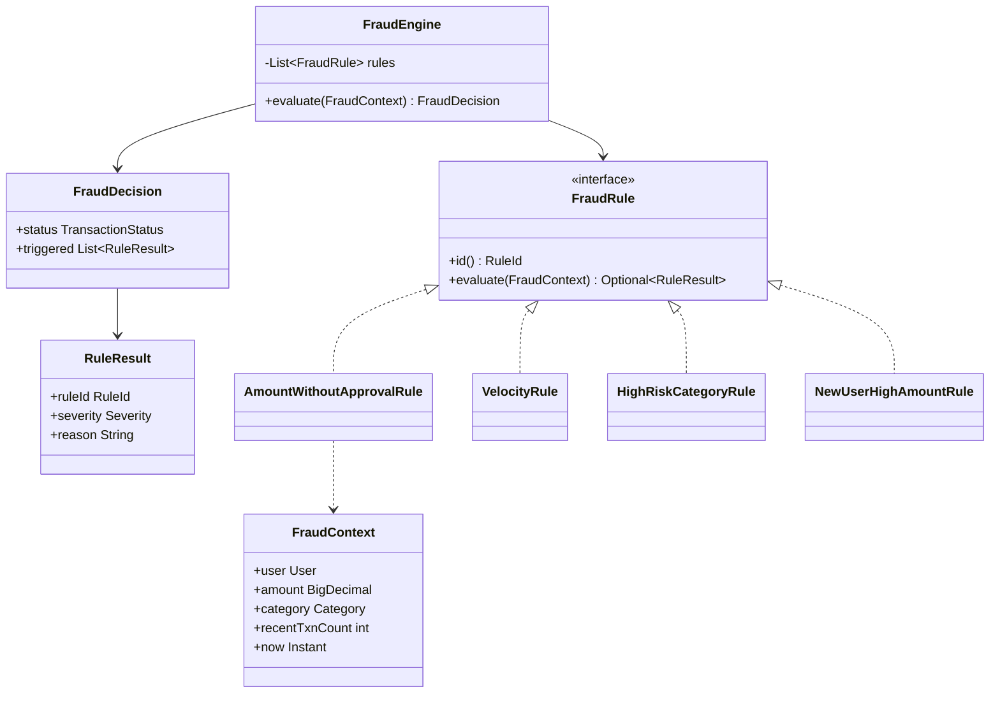
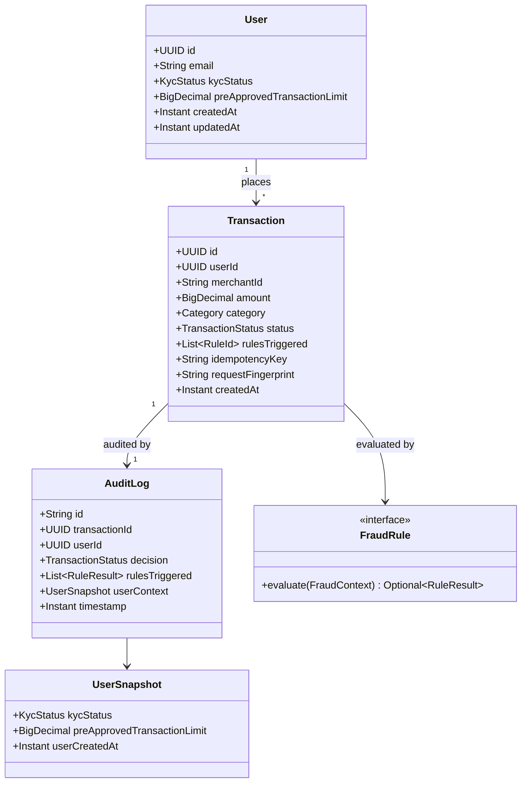
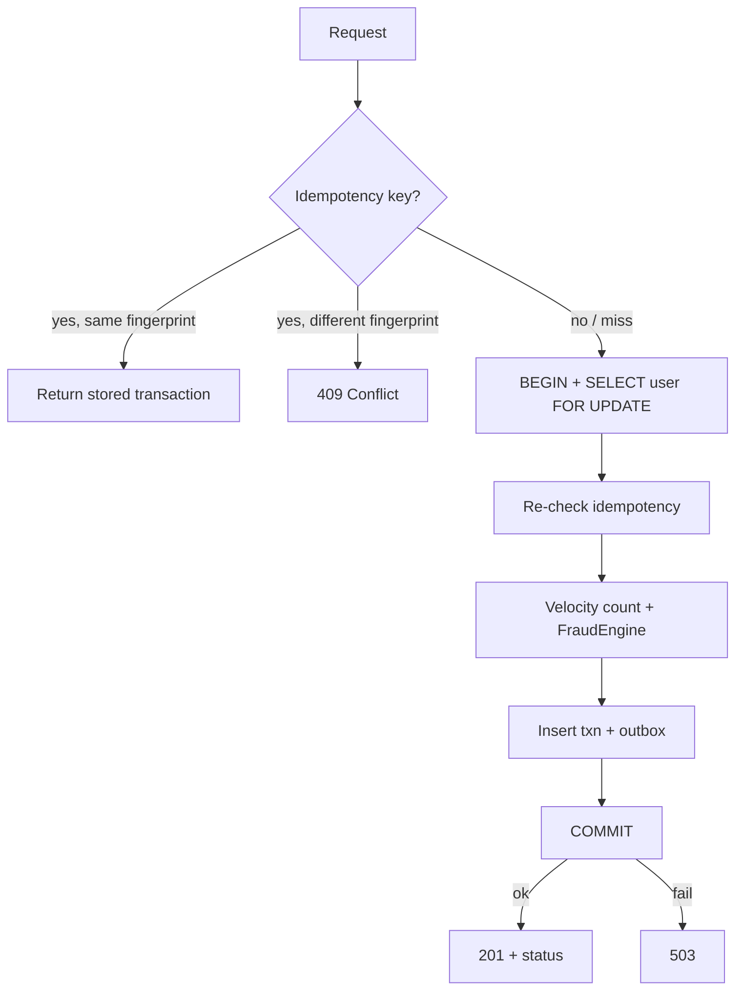

# Low-Level Design

> **Docs index:** [README.md](README.md) · [requirements-and-assumptions.md](requirements-and-assumptions.md) · [high-level-design.md](high-level-design.md) · [low-level-design.md](low-level-design.md)

This document covers fraud rules, domain and data models, API contracts, concurrency/idempotency details, observability, testing, and implementation sequence.

See [high-level-design.md](high-level-design.md) for architecture and trade-offs, and [requirements-and-assumptions.md](requirements-and-assumptions.md) for goals and assumptions.

---

## Fraud Detection Engine


### Why a dedicated engine (not inline `if`s in the service)

Putting rules in `ProcessTransactionHandler` would mix orchestration with policy and make Rule 4 (flag-but-allow) easy to get wrong when combined with declines.

Rules live in a **small in-process engine**:

- `FraudRule` — one class per rule, independently unit-tested.
- `FraudEngine` — runs all rules, aggregates by severity.
- `FraudContext` — immutable snapshot (user, amount, category, velocity count, clock).
- No I/O inside a rule. The service gathers data; the engine only decides.

Do **not** introduce Drools or an external rules engine for four fixed rules. Adding a fifth rule is a new class plus registration.




### Aggregation / precedence

```
severity(DECLINE) > severity(FLAG) > severity(ALLOW)

if any rule returns DECLINE → TransactionStatus.DECLINED
else if any rule returns FLAG    → TransactionStatus.FLAGGED
else                             → TransactionStatus.APPROVED
```

All rules always run. Example: amount `12000`, category `CRYPTO`, user age 10 days can trigger `AMOUNT_WITHOUT_APPROVAL` (DECLINE), `HIGH_RISK_CATEGORY` (DECLINE), and `NEW_USER_HIGH_AMOUNT` (FLAG). Final decision is `DECLINED`; audit still contains all three triggered rules.

`FLAGGED` is a **successful** authorization that requires review. The transaction is stored and the client receives `201`.

### Rules


| ID                        | Condition                                                                                                  | Outcome   |
| ------------------------- | ---------------------------------------------------------------------------------------------------------- | --------- |
| `AMOUNT_WITHOUT_APPROVAL` | `amount > 10_000` **and** `amount > user.preApprovedTransactionLimit` (`null` or `0` = no prior approval)  | `DECLINE` |
| `VELOCITY`                | count of this user's `APPROVED`**/**`FLAGGED` rows with `created_at` in `[now - 60s, now]` **already ≥ 3** | `DECLINE` |
| `HIGH_RISK_CATEGORY`      | category ∈ high-risk set **and** `amount > 5_000`                                                          | `DECLINE` |
| `NEW_USER_HIGH_AMOUNT`    | `amount > 5_000` **and** `user.createdAt > now - 30 days` (user younger than 30 days)                      | `FLAG`    |


`preApprovedTransactionLimit` is the “prior user approval” from Rule 1. Operations raises it via `PATCH /users/{id}` after an offline approval. A limit of `15000` allows a `12000` payment and still declines `16000`.

High-risk categories are a Spring `@ConfigurationProperties` set so they can change without a code edit.

### Clock

Rules use a `Clock` bean (`Clock.systemUTC()` in prod, fixed clock in tests) so 30-day and 60-second windows are deterministic.

---

## Rule 2 — Velocity (authoritative definition)

> **For each incoming transaction, evaluate a sliding 60-second window from** `now - 60 seconds` **through** `now`**, inclusive. Count only previously persisted transactions for the same user whose status is** `APPROVED` **or** `FLAGGED`**. If three or more qualifying transactions already exist, the incoming transaction is declined. Concurrent requests for the same user are serialized using** `SELECT … FOR UPDATE` **on the user row, with the lock, velocity query, fraud evaluation, transaction insert, and audit-outbox insert occurring inside the same PostgreSQL transaction.**


### Sliding window (not fixed buckets)

```text
windowStart = currentTransactionTime - 60 seconds
evaluate transactions in [windowStart, now]
```

Example: new transaction at `12:01:10` → window `12:00:10` … `12:01:10`.

Not clock-minute buckets such as `12:00:00 → 12:00:59`.

### Inclusive time boundary

```sql
created_at >= :windowStart   -- windowStart = now - 60 seconds
AND created_at <= :now
```

A row exactly at `now - 60s` **is** counted. A row at `now - 60s - 1ms` is **not**.

### Counting semantics

Count only successful authorization outcomes:

```text
APPROVED, FLAGGED   → counted
DECLINED            → not counted
```

Example history in-window: `APPROVED`, `APPROVED`, `DECLINED`, `FLAGGED` → Rule 2 count is **3**, not 4. A declined attempt does not extend the velocity block.

### Reference query

```sql
SELECT COUNT(*)
FROM transactions
WHERE user_id = :userId
  AND status IN ('APPROVED', 'FLAGGED')
  AND created_at >= :windowStart
  AND created_at <= :now;
```


### Threshold

```java
if (recentCount >= 3) {
    return RuleResult.decline(RuleId.VELOCITY);
}
```

Example: `T1=12:00:20`, `T2=12:00:35`, `T3=12:00:50`, new request `12:01:00` → `recentCount = 3` → incoming would be #4 → `DECLINE`.

### Concurrency protection

```sql
SELECT *
FROM users
WHERE id = :userId
FOR UPDATE;
```

```text
Request A                         Request B
SELECT USER FOR UPDATE
acquires lock
                                  SELECT USER FOR UPDATE
                                  waits
count recent = 2
process transaction #3
commit / release lock
                                  acquires lock
                                  count recent = 3
                                  transaction #4 DECLINED
                                  commit
```

Different users lock different rows and proceed concurrently.

---

## Domain Model




### Enumerations

- `TransactionStatus`: `APPROVED` | `FLAGGED` | `DECLINED`
- `KycStatus`: `PENDING` | `VERIFIED` | `REJECTED`
- `Category`: `GROCERIES`, `TRAVEL`, `ELECTRONICS`, `GAMBLING`, `CRYPTO`, `CASH_ADVANCE`, `MONEY_TRANSFER`, `ADULT`, `OTHER`
- `Severity`: `ALLOW` | `FLAG` | `DECLINE`
- `OutboxStatus`: `PENDING` | `PUBLISHED`

`UserSnapshot` is copied into the audit document at decision time so later KYC or limit changes do not rewrite history. KYC is audit context only — no fraud rule reads it.

---

## Data Design


### PostgreSQL (system of record)

Isolation level: `READ COMMITTED`. Per-user invariants are protected by `SELECT … FOR UPDATE` on the user row, not by raising isolation globally.

`users`


| Column                           | Type                   | Notes                                 |
| -------------------------------- | ---------------------- | ------------------------------------- |
| `id`                             | `UUID PK`              |                                       |
| `email`                          | `TEXT UNIQUE NOT NULL` |                                       |
| `kyc_status`                     | `TEXT NOT NULL`        | Audit / profile only                  |
| `pre_approved_transaction_limit` | `NUMERIC(19,4)`        | `NULL` = no high-value prior approval |
| `created_at`                     | `TIMESTAMPTZ NOT NULL` | Used by Rule 4                        |
| `updated_at`                     | `TIMESTAMPTZ NOT NULL` |                                       |


`transactions`


| Column                | Type                       | Notes                                               |
| --------------------- | -------------------------- | --------------------------------------------------- |
| `id`                  | `UUID PK`                  | Returned to the client                              |
| `user_id`             | `UUID NOT NULL FK → users` |                                                     |
| `merchant_id`         | `TEXT NOT NULL`            | Opaque merchant identifier                          |
| `amount`              | `NUMERIC(19,4) NOT NULL`   | `CHECK (amount > 0)`                                |
| `category`            | `TEXT NOT NULL`            |                                                     |
| `status`              | `TEXT NOT NULL`            | APPROVED / FLAGGED / DECLINED                       |
| `rules_triggered`     | `TEXT[]`                   | Rule IDs                                            |
| `idempotency_key`     | `TEXT`                     | Nullable                                            |
| `request_fingerprint` | `TEXT`                     | SHA-256 of canonical payload; used with idempotency |
| `created_at`          | `TIMESTAMPTZ NOT NULL`     | Decision time; velocity window                      |


Indexes:

```sql
CREATE INDEX idx_transaction_user_created
ON transactions(user_id, created_at DESC);

-- Optional; helpful when filtering by status for Rule 2
CREATE INDEX idx_transaction_user_status_created
ON transactions(user_id, status, created_at DESC);

CREATE UNIQUE INDEX idx_transaction_user_idempotency
ON transactions(user_id, idempotency_key)
WHERE idempotency_key IS NOT NULL;
```

The simpler `(user_id, created_at)` index is sufficient at challenge scale. The unique partial index is the final idempotency invariant.

`audit_outbox`


| Column            | Type                     | Notes                        |
| ----------------- | ------------------------ | ---------------------------- |
| `id`              | `BIGSERIAL PK`           |                              |
| `transaction_id`  | `UUID NOT NULL UNIQUE`   |                              |
| `payload`         | `JSONB NOT NULL`         | Full audit document          |
| `status`          | `TEXT NOT NULL`          | `PENDING` / `PUBLISHED` only |
| `attempts`        | `INT NOT NULL DEFAULT 0` |                              |
| `last_error`      | `TEXT`                   | Last publish failure message |
| `next_attempt_at` | `TIMESTAMPTZ NOT NULL`   | Exponential backoff          |
| `created_at`      | `TIMESTAMPTZ NOT NULL`   |                              |


```sql
CREATE INDEX idx_audit_outbox_pending
ON audit_outbox(status, next_attempt_at);
```

No terminal `FAILED` state that silently stops delivery. Events are retained; backoff grows; metrics and alerts fire. If a dead-letter path is added later, the original payload remains durable and recoverable.

The outbox row is inserted in the **same** database transaction as the payment row (transactional outbox).

### Database constraints (defense in depth)

API validation gives good client errors; constraints protect invariants:

- `CHECK (amount > 0)`
- `NOT NULL` on required fields
- `UNIQUE users.email`
- `UNIQUE (user_id, idempotency_key) WHERE idempotency_key IS NOT NULL`
- `UNIQUE audit_outbox.transaction_id`


### MongoDB (audit projection)

Collection `audit_logs` — **append-only**. Existing audit records are **never overwritten**. Corrections, if ever needed, are additional events.

```json
{
  "_id": "txn-uuid",
  "transactionId": "txn-uuid",
  "userId": "user-uuid",
  "decision": "FLAGGED",
  "rulesTriggered": [
    { "ruleId": "NEW_USER_HIGH_AMOUNT", "severity": "FLAG", "reason": "..." }
  ],
  "userContext": {
    "kycStatus": "VERIFIED",
    "preApprovedTransactionLimit": 0,
    "userCreatedAt": "2026-08-20T10:00:00Z"
  },
  "amount": "6200.00",
  "merchantId": "m_123",
  "category": "ELECTRONICS",
  "timestamp": "2026-09-10T16:01:02Z"
}
```

Publishing uses **immutable insert** with `_id = transactionId`. On retry, `DuplicateKeyException` means the audit was already persisted — treat as success and mark outbox `PUBLISHED`. Do not upsert/rewrite history.

Indexes: `{ userId: 1, timestamp: -1 }`, `{ decision: 1, timestamp: -1 }`.

### Schema migrations

**Liquibase** only (not Flyway):

```text
db/changelog/
├── db.changelog-master.yaml
└── changes/
    ├── 001-create-users.yaml
    ├── 002-create-transactions.yaml
    └── 003-create-audit-outbox.yaml
```

---

## API Design

Base path: `/api/v1`. JSON. `X-Request-Id` is accepted or generated, echoed as a response header, and included in every body via `meta.requestId`.

Controllers return `ResponseEntity<ApiResponse<T>>` so the **HTTP status line** and the envelope stay in sync. Do **not** put an HTTP `statusCode` field in the body (HTTP is authoritative).

### Standard response envelope

Every endpoint uses the same shape:

```java
public record ApiResponse<T>(
        T data,
        String message,
        List<ApiError> errors,
        ApiMeta meta
) {}

public record ApiError(
        String code,
        String field,
        String message
) {}

public record ApiMeta(
        String requestId
) {}
```

| Field | Success | Error | Notes |
| ----- | ------- | ----- | ----- |
| `data` | object or array | `null` | The resource(s) |
| `message` | short human summary | short human summary | Not for client branching |
| `errors` | `[]` | one or more items | Stable `code` for clients; optional `field` for validation |
| `meta.requestId` | always | always | Correlate with logs / `X-Request-Id` |

**Factory helpers** (e.g. `ApiResponse.ok`, `ApiResponse.created`, `ApiResponse.failure`) keep controllers thin. `GlobalExceptionHandler` maps domain/API exceptions to the same envelope.

**Business vs API errors:** fraud `DECLINED` / `FLAGGED` are **success** payloads inside `data.status`. They must **never** appear in `errors[]`. `errors[]` is only for request, authz, conflict, and infrastructure failures.

### Transactions

`POST /api/v1/transactions`

Headers: optional `Idempotency-Key`.

Request body:

```json
{
  "amount": 6200.00,
  "userId": "3fa85f64-5717-4562-b3fc-2c963f66afa6",
  "merchantId": "mch_9f2",
  "category": "ELECTRONICS"
}
```


| Outcome                                 | HTTP          | `data`                         | `errors` |
| --------------------------------------- | ------------- | ------------------------------ | -------- |
| Processed (any business outcome)        | `201 Created` | transaction (`APPROVED` / `FLAGGED` / `DECLINED`) | `[]` |
| Unknown user                            | `404`         | `null`                         | `USER_NOT_FOUND` |
| Same idempotency key, different payload | `409`         | `null`                         | `IDEMPOTENCY_CONFLICT` |
| Malformed / invalid request             | `400`         | `null`                         | `VALIDATION_ERROR` (per field) |
| Resource not found (`GET`)              | `404`         | `null`                         | `NOT_FOUND` |
| PostgreSQL unavailable / commit failed  | `503`         | `null`                         | `SERVICE_UNAVAILABLE` |


All three business statuses return `201` because each represents a successfully evaluated and **persisted** transaction resource. The authorization outcome lives in `data.status`. `DECLINED` means the **business** rejected the payment — not that the HTTP request failed.

Success example (`DECLINED`):

```json
{
  "data": {
    "transactionId": "7c9e6679-7425-40de-944b-e07fc1f90ae7",
    "status": "DECLINED",
    "amount": 12000.00,
    "rulesTriggered": ["HIGH_RISK_CATEGORY"],
    "createdAt": "2026-09-10T16:01:02Z"
  },
  "message": "Transaction processed",
  "errors": [],
  "meta": {
    "requestId": "req_abc123"
  }
}
```

Success example (`FLAGGED`):

```json
{
  "data": {
    "transactionId": "7c9e6679-7425-40de-944b-e07fc1f90ae7",
    "status": "FLAGGED",
    "amount": 6200.00,
    "rulesTriggered": ["NEW_USER_HIGH_AMOUNT"],
    "createdAt": "2026-09-10T16:01:02Z"
  },
  "message": "Transaction processed",
  "errors": [],
  "meta": {
    "requestId": "req_abc123"
  }
}
```

Validation error example:

```json
{
  "data": null,
  "message": "Validation failed",
  "errors": [
    {
      "code": "VALIDATION_ERROR",
      "field": "amount",
      "message": "must be greater than 0"
    }
  ],
  "meta": {
    "requestId": "req_abc123"
  }
}
```

Infrastructure error example:

```json
{
  "data": null,
  "message": "Service temporarily unavailable",
  "errors": [
    {
      "code": "SERVICE_UNAVAILABLE",
      "field": null,
      "message": "Unable to persist transaction"
    }
  ],
  "meta": {
    "requestId": "req_abc123"
  }
}
```

`GET /api/v1/transactions/{id}` — fetch a stored decision (useful for idempotent clients and ops). HTTP `200` + envelope with transaction in `data`, or `404` + `NOT_FOUND`.

### Infrastructure failure vs business decline

**Business decline**

```text
Authoritative data loaded successfully
        ↓
Fraud engine evaluated transaction
        ↓
A DECLINE rule triggered
        ↓
Transaction persisted as DECLINED
        ↓
201 + ApiResponse.data.status = DECLINED  (errors = [])
```

**Infrastructure failure**

```text
PostgreSQL unavailable or commit fails
        ↓
Transaction could not be safely evaluated/persisted
        ↓
503 + ApiResponse.data = null, errors = [SERVICE_UNAVAILABLE]
```

`DECLINED` = the business rejected the transaction. `503` = the system could not safely reach or durably store a business decision. Never fabricate a fraud decline for an infrastructure outage.

### Users


| Method  | Path                 | HTTP success | Purpose                                         |
| ------- | -------------------- | ------------ | ----------------------------------------------- |
| `POST`  | `/api/v1/users`      | `201`        | Create user (sets `createdAt`)                  |
| `GET`   | `/api/v1/users/{id}` | `200`        | Query profile                                   |
| `PATCH` | `/api/v1/users/{id}` | `200`        | Update KYC and/or `preApprovedTransactionLimit` |


Create body: `{ "email", "kycStatus"? }`. Default KYC `PENDING`, `preApprovedTransactionLimit` null.

All user endpoints use the same `ApiResponse` envelope (`data` = user resource on success).

### Idempotency

Do **not** compare raw JSON strings. Store a deterministic request fingerprint from canonical business fields:

```text
SHA-256(canonical(userId, merchantId, amount, category))
```

| Same key + same fingerprint | Return original transaction (`201` + same `data`) |
| Same key + different fingerprint | `409` + `IDEMPOTENCY_CONFLICT` |

Application checks (before and after acquiring the user lock) provide friendly handling. The unique DB constraint is the final correctness guarantee:

> Application logic provides friendly handling; database constraints protect invariants.

Recommended sequence:

```text
1. Lookup existing transaction using userId + Idempotency-Key
2. If found and fingerprint matches → return original result
3. If found and fingerprint differs → 409
4. Acquire user row with SELECT … FOR UPDATE
5. Check idempotency again
6. If another request created it while waiting → return it
7. Otherwise process normally
```

---

## Concurrency, Idempotency, and Time




- **Velocity** uses inclusive `[now - 60s, now]` on `APPROVED`/`FLAGGED` only, under the same user-row lock as the insert.
- **Time** is `Instant.now(clock)` applied as `created_at` for both the row and the 60s/30d windows — one timestamp per request.
- **Idempotency** unique index prevents double-insert if two retries overlap; the loser re-reads the winner’s row.

---

## Observability

### Structured logging (SLF4J + Logback)

**Requirement:** SLF4J API + Logback implementation. **Never** `System.out.println` / `System.err.println`.

All application classes obtain loggers through a single factory so usage stays consistent and easy to review:

```text
common/logging/LogFactory.java
```

```java
package com.example.payment.common.logging;

import org.slf4j.Logger;
import org.slf4j.LoggerFactory;

public final class LogFactory {

    private LogFactory() {}

    public static Logger getLogger(Class<?> type) {
        return LoggerFactory.getLogger(type);
    }
}
```

Usage in every class:

```java
private static final Logger log = LogFactory.getLogger(ProcessTransactionHandler.class);

log.info("transaction.processed status={} transactionId={} durationMs={}",
        status, transactionId, durationMs);
```

**Conventions:**

- One `static final Logger` per class via `LogFactory.getLogger(Class)`.
- Prefer parameterized messages (`{}`), not string concatenation.
- JSON layout via Logback (e.g. Logstash encoder); include MDC fields where useful: `requestId`, `transactionId`, `userId` (privacy permitting), `status`, `rulesTriggered`, `durationMs`.
- Filter / interceptor sets `requestId` (from `X-Request-Id` or generated) into MDC at request start and clears it at end.
- Do **not** log credentials, tokens, or full sensitive financial payloads.

Metrics:


| Metric                               | Purpose                           |
| ------------------------------------ | --------------------------------- |
| `payment.transactions.total{status}` | Throughput by outcome             |
| `fraud.rule.triggered{rule}`         | Which rules fire                  |
| `payment.processing.duration`        | End-to-end latency                |
| `velocity.lock.wait`                 | User-row lock contention          |
| `outbox.pending.count`               | Backlog size                      |
| `outbox.oldest.pending.age`          | How far Mongo audit lag has grown |
| `outbox.publish.failures`            | Publish errors                    |
| `mongo.publish.duration`             | Publisher latency                 |


Health (Spring Actuator):

- **Liveness** = process healthy.
- **Readiness** = PostgreSQL up (required to safely process payments).
- Mongo down → still **READY** but degraded (async audit projection only).

---

## Testing Strategy (mapped to this design)

Use **Testcontainers** (PostgreSQL + MongoDB), not H2 — the design depends on `FOR UPDATE`, `SKIP LOCKED`, partial indexes, and `TIMESTAMPTZ`.


| Layer   | What                                                                                                                                                                  | How                                 |
| ------- | --------------------------------------------------------------------------------------------------------------------------------------------------------------------- | ----------------------------------- |
| Domain  | Each `FraudRule`; aggregation (no rules → APPROVED, FLAG only, DECLINE only, FLAG+DECLINE → DECLINED, multiple DECLINEs); Rule 2 inclusive 60s edge; Rule 4 age edges | JUnit 5, fixed `Clock`, no Spring   |
| Command | Lock → re-check idempotency → engine → persist outbox; `503` on PG failure; fingerprint conflict                                                                      | Mockito on repositories / out-ports |
| Query   | `GetUser` / `GetTransaction` return stored views; 404 when missing                                                                                                    | Mockito or `@DataJpaTest`           |
| Data    | Unique idempotency, velocity query, outbox insert with txn rollback                                                                                                   | Testcontainers PostgreSQL           |
| Audit   | Insert + DuplicateKey = already delivered; Mongo outage → PENDING → recover → PUBLISHED                                                                               | Testcontainers Mongo (+ PG)         |
| API     | Envelope on all statuses; `201` (APPROVED/FLAGGED/DECLINED) / `404` / `409` / `503`; validation `errors[]`                                 | `@SpringBootTest` + Testcontainers  |


### Concurrency regression (Rule 2 + lock)

**Incorrect:** three existing qualifying transactions + two concurrent requests (both already violate Rule 2).

**Correct:**

```text
2 existing APPROVED/FLAGGED transactions
+
2 simultaneous requests
```

Expected: Request A sees `recentCount = 2` → may `APPROVED`/`FLAGGED` as #3. Request B then sees `recentCount = 3` → `DECLINED` as #4.

Assertion: exactly one may be `APPROVED`/`FLAGGED`; exactly one is `DECLINED` by Rule 2.

### Idempotency tests

- Same key + same fingerprint → original `T1`; no second transaction, no second outbox, no extra Rule 2 count.
- Same key + different payload → `409`.
- Concurrent duplicates with same key → exactly one transaction, one outbox event, both resolve to the same result.


### Time-boundary tests (injected `Clock`)

- Rule 2: transaction exactly 60 seconds old → **counted** (`created_at >= now - 60s`).
- Rule 2: 60 seconds + 1 ms old → **not** counted.
- Rule 4: user exactly 30 days old, younger than 30 days, older than 30 days — document inclusive/exclusive consistently with `user.createdAt > now - 30 days` (exactly 30 days old → **not** flagged).


### Outbox tests

- Mongo available → audit inserted → outbox `PUBLISHED`.
- Mongo unavailable → transaction still commits → outbox `PENDING` → Mongo restored → publisher retries → insert → `PUBLISHED`.
- Ambiguous retry: Mongo insert succeeded but outbox not marked → retry → duplicate `_id` → treat as delivered → mark `PUBLISHED`.

---

## Implementation Sequence

Aligned with the challenge’s suggested order:

1. Docker Compose + Liquibase schema (users, transactions, outbox) + Mongo collection.
2. Domain model + `FraudEngine` and four rules with unit tests (including aggregation and time boundaries).
3. `ProcessTransactionHandler` with `SELECT … FOR UPDATE`, double idempotency check, and outbox write inside one PG transaction.
4. User command/query handlers (`CreateUser`, `UpdateUser` for `preApprovedTransactionLimit`/KYC, `GetUser`).
5. Outbox publisher (`SKIP LOCKED`, insert-or-duplicate-key, exponential backoff) + Mongo.
6. API layer (`ApiResponse` envelope, `201` for all business statuses, `503` for PG failures), OpenAPI, structured logging via `LogFactory` + Logback JSON, metrics.
7. Integration tests (Testcontainers), JaCoCo, README (include the core guarantee and Mongo justification).

This order keeps the fraud policy correct before HTTP and storage adapters accumulate around it.

