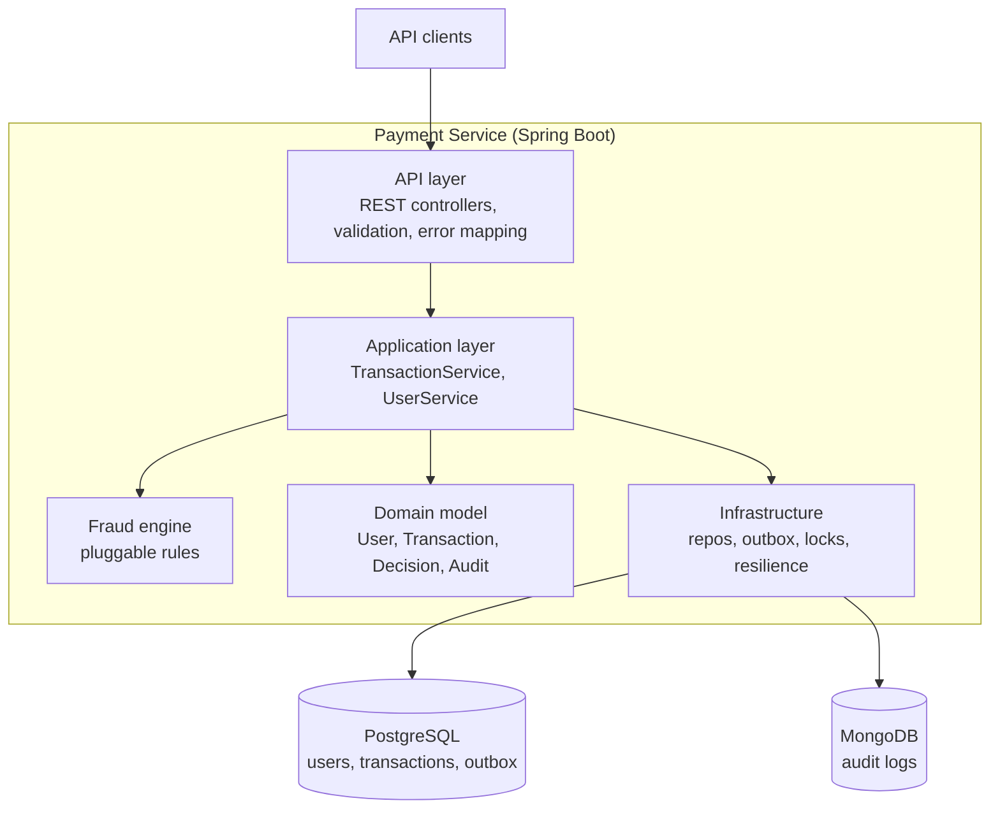
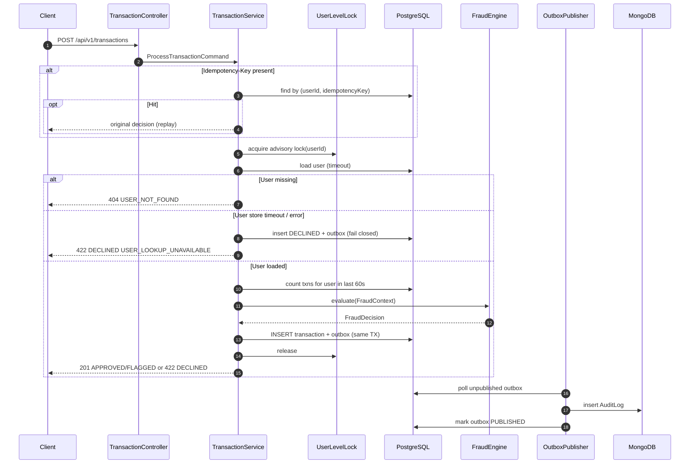
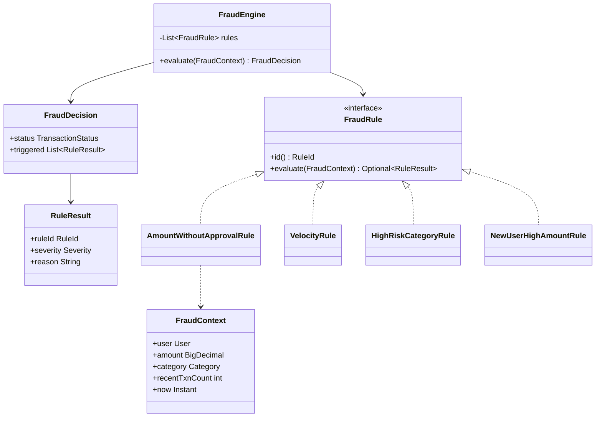
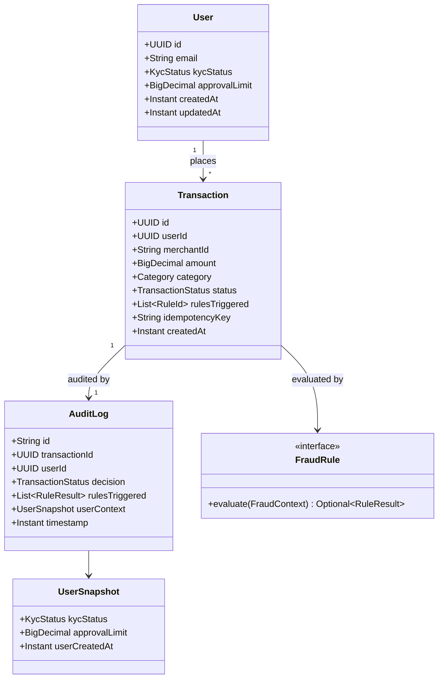
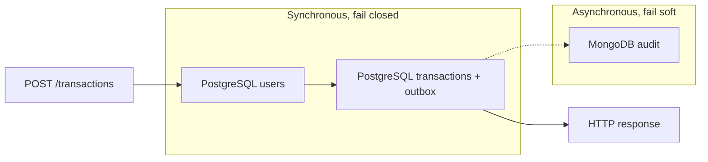
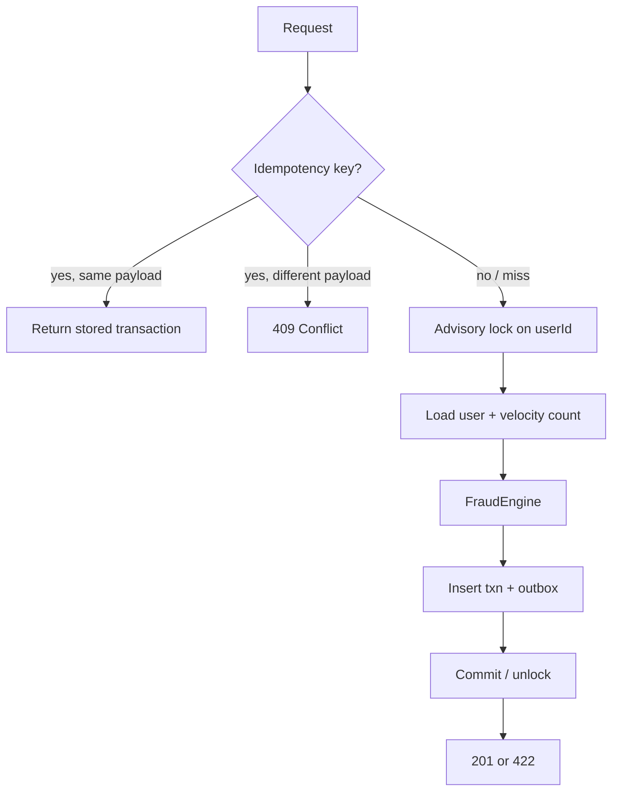
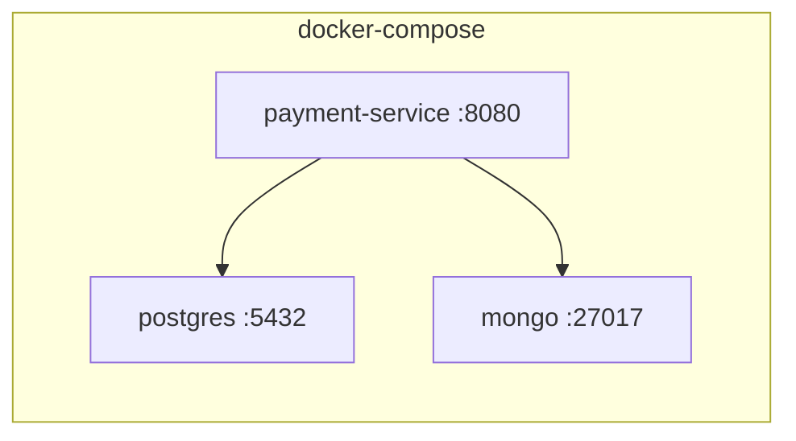

# Payment Processing System — System Design

This document describes the architecture of a payment processing service for a digital bank. The system accepts payment transactions, evaluates them against fraud rules, records an immutable audit trail, and exposes user-management APIs.

The design is sized for a single Spring Boot service with PostgreSQL and MongoDB, runnable via Docker Compose. Choices below are made so the system stays correct under concurrency, degrades when a store is slow or down, and remains testable.

---

## 1. Goals and Constraints

### Functional

- Accept a transaction (`amount`, `userId`, `merchantId`, `category`), assign an ID and timestamp, and return `APPROVED`, `FLAGGED`, or `DECLINED`.
- Evaluate four fraud rules on every request.
- Persist an audit record for every decision (rules triggered, timestamp, user context). Audit data must survive restarts.
- Manage users: creation date, KYC status, approval limits; CRUD-style REST APIs.

### Non-functional

- Concurrent requests for the same user must not bypass velocity limits.
- Downstream slowness or outage must not lose transaction data.
- Layered, testable Java (Spring Boot 3.x, Maven, JUnit 5, Testcontainers, JaCoCo ≥ 75%).
- Structured logging (SLF4J / Logback). Observable HTTP API (OpenAPI).

### Explicit assumptions

These are not specified in the brief; they are called out so behavior is deterministic:

| Topic | Assumption |
| --- | --- |
| Currency | Single currency (`USD`). Amounts stored as `NUMERIC(19,4)`. |
| Velocity window | Rule 2 counts **all** attempts (approved, flagged, and declined) in the last 60 seconds. Declined retries still consume the window so abuse cannot brute-force through. |
| Velocity threshold | `> 3` means the **4th** request in 60 seconds is declined. At most three attempts succeed in the window. |
| Rule composition | All rules run. Any `DECLINE` wins over `FLAG`. Otherwise `FLAG` wins over `APPROVED`. |
| High-risk categories | `GAMBLING`, `CRYPTO`, `CASH_ADVANCE`, `MONEY_TRANSFER`, `ADULT`. Extensible via config. |
| Missing user | Unknown `userId` is a client error (`404`), not a fraud decline. |
| User-store failure during fraud | Fail **closed**: persist the attempt as `DECLINED` with reason `USER_LOOKUP_UNAVAILABLE`. A bank should not approve when it cannot load KYC / limits. |
| Idempotency | Optional `Idempotency-Key` header. Same key + same user + same payload returns the original result. Same key + different payload returns `409`. |

---

## 2. High-Level Architecture

The product is one bounded context: **payment authorization with fraud screening**. It is deployed as one Spring Boot application plus two data stores.



### Main components

| Component | Responsibility |
| --- | --- |
| **API layer** | HTTP contracts, request validation, status-code mapping, OpenAPI. No business rules. |
| **Transaction service** | Orchestrates one payment: idempotency, per-user lock, load user, run fraud, persist transaction + outbox, return decision. |
| **User service** | Create / read / update user profiles used by fraud (KYC, created-at, approval limit). |
| **Fraud engine** | Evaluates an ordered set of `FraudRule` implementations against a `FraudContext`. Returns a `FraudDecision`. |
| **PostgreSQL** | Source of truth for users and transactions. Also holds the audit **outbox** so nothing is lost if Mongo is down. |
| **MongoDB** | Query-optimized, append-only audit collection. Eventually consistent with PostgreSQL. |
| **Outbox publisher** | Background worker that ships committed outbox rows to Mongo and retries on failure. |
| **Resilience** | Timeouts, circuit breakers, and fail-closed / fail-soft policies per dependency. |

PostgreSQL is the **system of record**. MongoDB is an **audit projection**. A decision is durable as soon as the PostgreSQL transaction commits, even if Mongo is unavailable.

---

## 3. Layered Design (Inside the Service)

```
com.payments
├── api                  # controllers, DTOs, exception handlers, OpenAPI
├── application          # use cases: TransactionService, UserService
├── domain
│   ├── model            # User, Transaction, Money, Category, KycStatus
│   ├── decision         # TransactionStatus, FraudDecision, RuleResult
│   └── fraud            # FraudEngine, FraudRule, FraudContext, rules/*
└── infrastructure
    ├── persistence
    │   ├── postgres     # JPA entities, Spring Data repos
    │   └── mongo        # AuditLogDocument, Mongo repo
    ├── outbox           # OutboxEntity, OutboxPublisher
    ├── concurrency      # UserLevelLock (Postgres advisory lock)
    └── resilience       # TimeLimiter / CircuitBreaker around Mongo (and optional user cache)
```

**Dependency rule:** `api` → `application` → `domain`. `infrastructure` implements ports defined in `application`/`domain`. Domain has no Spring or JDBC types.

This keeps fraud rules unit-testable with plain objects, and keeps controllers free of persistence and locking details.

---

## 4. Request Flow — Process Transaction



### Processing steps (happy path)

1. Validate payload (amount > 0, required IDs, known category).
2. If an idempotency key is present, return the stored result when the payload matches.
3. Take a **PostgreSQL advisory lock** keyed by `userId` so velocity and inserts are serialized per user.
4. Load the user. Build `FraudContext` (user, amount, category, recent transaction count).
5. Run the fraud engine (all rules).
6. In **one** PostgreSQL transaction: insert `transactions` and `audit_outbox`.
7. Commit, release the lock, return the HTTP response.
8. The publisher writes the audit document to Mongo asynchronously.

The client is not blocked on Mongo. The audit record cannot disappear on restart because it lives in `audit_outbox` until Mongo ACK.

---

## 5. Fraud Detection Engine

### Why a dedicated engine (not inline `if`s in the service)

The brief asks where rules should live. Putting them in `TransactionService` would mix orchestration with policy and make Rule 4 (flag-but-allow) easy to get wrong when combined with declines.

Rules live in a **small in-process engine**:

- `FraudRule` — one class per rule, independently unit-tested.
- `FraudEngine` — runs all rules, aggregates by severity.
- `FraudContext` — immutable snapshot (user, amount, category, velocity count, clock).
- No I/O inside a rule. The service gathers data; the engine only decides.

Adding a fifth rule is a new class plus registration. No change to persistence or HTTP.



### Aggregation

```
severity(DECLINE) > severity(FLAG) > severity(ALLOW)

if any rule returns DECLINE → TransactionStatus.DECLINED
else if any rule returns FLAG    → TransactionStatus.FLAGGED
else                             → TransactionStatus.APPROVED
```

`FLAGGED` is a **successful** authorization that requires review. The transaction is stored and the client receives `201`.

### Rules

| ID | Condition | Outcome |
| --- | --- | --- |
| `AMOUNT_WITHOUT_APPROVAL` | `amount > 10_000` **and** `amount > user.approvalLimit` (limit `null` or `0` means no prior approval) | `DECLINE` |
| `VELOCITY` | count of this user's transactions with `created_at > now - 60s` **already ≥ 3** (the incoming request would be the 4th) | `DECLINE` |
| `HIGH_RISK_CATEGORY` | category ∈ high-risk set **and** `amount > 5_000` | `DECLINE` |
| `NEW_USER_HIGH_AMOUNT` | `amount > 5_000` **and** `user.createdAt > now - 30 days` | `FLAG` |

`approvalLimit` is the “prior user approval” from Rule 1. Operations raises it via `PATCH /users/{id}` after an offline approval. A limit of `15000` allows a `12000` payment and still declines `16000`.

High-risk categories are a Spring `@ConfigurationProperties` set so they can change without a code edit.

### Clock

Rules use a `Clock` bean (`Clock.systemUTC()` in prod, fixed clock in tests) so 30-day and 60-second windows are deterministic.

---

## 6. Domain Model



### Enumerations

- `TransactionStatus`: `APPROVED` | `FLAGGED` | `DECLINED`
- `KycStatus`: `PENDING` | `VERIFIED` | `REJECTED`
- `Category`: `GROCERIES`, `TRAVEL`, `ELECTRONICS`, `GAMBLING`, `CRYPTO`, `CASH_ADVANCE`, `MONEY_TRANSFER`, `ADULT`, `OTHER`
- `Severity`: `ALLOW` | `FLAG` | `DECLINE`
- `OutboxStatus`: `PENDING` | `PUBLISHED` | `FAILED`

`UserSnapshot` is copied into the audit document at decision time so later KYC or limit changes do not rewrite history.

---

## 7. Data Design

### PostgreSQL (system of record)

**`users`**

| Column | Type | Notes |
| --- | --- | --- |
| `id` | `UUID PK` | |
| `email` | `TEXT UNIQUE NOT NULL` | |
| `kyc_status` | `TEXT NOT NULL` | |
| `approval_limit` | `NUMERIC(19,4)` | `NULL` = no high-value approval |
| `created_at` | `TIMESTAMPTZ NOT NULL` | Used by Rule 4 |
| `updated_at` | `TIMESTAMPTZ NOT NULL` | |

**`transactions`**

| Column | Type | Notes |
| --- | --- | --- |
| `id` | `UUID PK` | Returned to the client |
| `user_id` | `UUID NOT NULL FK → users` | |
| `merchant_id` | `TEXT NOT NULL` | Opaque merchant identifier |
| `amount` | `NUMERIC(19,4) NOT NULL` | `CHECK (amount > 0)` |
| `category` | `TEXT NOT NULL` | |
| `status` | `TEXT NOT NULL` | APPROVED / FLAGGED / DECLINED |
| `rules_triggered` | `TEXT[]` | Rule IDs |
| `idempotency_key` | `TEXT` | Nullable |
| `created_at` | `TIMESTAMPTZ NOT NULL` | Decision time; velocity window |

Indexes:

- `INDEX tx_user_created (user_id, created_at DESC)` — Rule 2 count.
- `UNIQUE (user_id, idempotency_key) WHERE idempotency_key IS NOT NULL` — replay safety.

**`audit_outbox`**

| Column | Type | Notes |
| --- | --- | --- |
| `id` | `BIGSERIAL PK` | |
| `transaction_id` | `UUID NOT NULL UNIQUE` | |
| `payload` | `JSONB NOT NULL` | Full audit document |
| `status` | `TEXT NOT NULL` | PENDING / PUBLISHED / FAILED |
| `attempts` | `INT NOT NULL DEFAULT 0` | |
| `next_attempt_at` | `TIMESTAMPTZ NOT NULL` | Backoff |
| `created_at` | `TIMESTAMPTZ NOT NULL` | |

The outbox row is inserted in the **same** database transaction as the payment row (transactional outbox).

### MongoDB (audit projection)

Collection `audit_logs`:

```json
{
  "_id": "txn-uuid",
  "transactionId": "txn-uuid",
  "userId": "user-uuid",
  "decision": "FLAGGED",
  "rulesTriggered": [
    { "ruleId": "NEW_USER_HIGH_AMOUNT", "severity": "FLAG", "reason": "..." }
  ],
  "userContext": {
    "kycStatus": "VERIFIED",
    "approvalLimit": 0,
    "userCreatedAt": "2026-08-20T10:00:00Z"
  },
  "amount": "6200.00",
  "merchantId": "m_123",
  "category": "ELECTRONICS",
  "timestamp": "2026-09-10T16:01:02Z"
}
```

`_id` = `transactionId` makes publishes idempotent (retry-safe upsert).

Indexes: `{ userId: 1, timestamp: -1 }`, `{ decision: 1, timestamp: -1 }`.

---

## 8. API Design

Base path: `/api/v1`. JSON. `X-Request-Id` echoed on every response. Validation errors: `400` with a field list. Unexpected failures: `500` with a stable `code`.

### Transactions

`POST /api/v1/transactions`

Headers: optional `Idempotency-Key`.

```json
{
  "amount": 6200.00,
  "userId": "3fa85f64-5717-4562-b3fc-2c963f66afa6",
  "merchantId": "mch_9f2",
  "category": "ELECTRONICS"
}
```

| Outcome | HTTP | Body `status` |
| --- | --- | --- |
| Authorized | `201 Created` | `APPROVED` or `FLAGGED` |
| Business decline | `422 Unprocessable Entity` | `DECLINED` |
| Unknown user | `404` | — |
| Duplicate key, different body | `409` | — |
| Malformed request | `400` | — |

Decline is an **error** for the client (payment not authorized) but the row is still stored. `FLAGGED` is success with extra review signal.

Response:

```json
{
  "transactionId": "7c9e6679-7425-40de-944b-e07fc1f90ae7",
  "status": "FLAGGED",
  "amount": 6200.00,
  "rulesTriggered": ["NEW_USER_HIGH_AMOUNT"],
  "createdAt": "2026-09-10T16:01:02Z"
}
```

`GET /api/v1/transactions/{id}` — fetch a stored decision (useful for idempotent clients and ops).

### Users

| Method | Path | Purpose |
| --- | --- | --- |
| `POST` | `/api/v1/users` | Create user (sets `createdAt`) |
| `GET` | `/api/v1/users/{id}` | Query profile |
| `PATCH` | `/api/v1/users/{id}` | Update KYC and/or `approvalLimit` |

Create body: `{ "email", "kycStatus"? }`. Default KYC `PENDING`, `approvalLimit` null.

---

## 9. Design Decisions and Trade-offs

### 9.1 Where fraud rules live

**Choice:** In-process strategy objects behind `FraudEngine`.

| Option | Pros | Cons |
| --- | --- | --- |
| `if`/`else` in the service | Fast to write | Untestable in isolation; composition bugs |
| Rules engine (Drools, etc.) | Hot-reload policies | Heavy for four static rules |
| **Java `FraudRule` + engine** | Unit-testable, explicit, easy to extend | Code change to add a rule |

Four fixed rules do not justify Drools. The engine interface is the seam if rules later move to config or a remote service.

### 9.2 Audit: sync vs async

**Choice:** **Transactional outbox** — synchronous durability in PostgreSQL, asynchronous projection to MongoDB.

| Option | Durability | Latency | Failure mode |
| --- | --- | --- | --- |
| Sync write to Mongo in the request | Strong if both succeed | Client waits on Mongo | Dual-write: PG committed, Mongo failed (or the reverse) |
| Fire-and-forget to Mongo | Weak | Fast | Lost on crash before send |
| **Outbox in the PG transaction** | Strong for the decision | Fast for the client | Mongo lags; publisher retries |

The brief requires audit logs to survive restarts and to never lose transaction data. The outbox satisfies both. Mongo is the searchable audit store, not the commit point.

If Mongo is down, `GET` of audit can optionally fall back to `audit_outbox.payload` (ops endpoint). The payment API does not depend on that.

### 9.3 Concurrency and Rule 2

**Race:** two concurrent payments for the same user both read `count = 3`, both approve, and the user gets five payments in 60 seconds.

**Choice:** `pg_advisory_xact_lock(hashtext(userId))` held for the read-count + insert transaction.

- Serializes only **that user**. Other users proceed in parallel.
- Lock is transaction-scoped; it releases on commit/rollback (no leaked session locks).
- Works with a single app instance and with multiple instances sharing one Postgres.

Pessimistic `SELECT FOR UPDATE` on `users` is an equivalent alternative; advisory locks avoid extra row contention on hot user profiles. An application-level mutex is **not** enough: it fails across instances.

Idempotency is a separate unique constraint, not a substitute for the velocity lock.

### 9.4 Consistency between PostgreSQL and MongoDB

This is **at-least-once, eventually consistent** replication:

1. PG commit is atomic (transaction + outbox).
2. Publisher upserts Mongo by `transactionId`, then marks `PUBLISHED`.
3. Crash between Mongo write and outbox update → retry; Mongo upsert is idempotent.
4. Crash before Mongo write → retry from outbox; no silent loss.

There is no two-phase commit. We accept a short window where PG is ahead of Mongo. That is the correct trade-off: authorization latency and durability beat cross-store linearizability.

### 9.5 Resilience and graceful degradation



| Dependency | Policy |
| --- | --- |
| PostgreSQL (users / txns) | JDBC timeout (e.g. 2s). If user load fails: **fail closed** — `DECLINED` + outbox, HTTP 422. If the write itself fails: `503`, nothing committed. |
| MongoDB | Not on the request path. Publisher: timeout, circuit breaker (Resilience4j), exponential backoff (`next_attempt_at`). Circuit open → skip poll briefly, outbox remains `PENDING`. |
| Process crash | In-flight HTTP may return 5xx; if PG committed, the decision and outbox are intact. Client retries with the same idempotency key. |

**Never lose transaction data** means: no decision is acknowledged to the client unless PostgreSQL has committed it; audit intent is in that same commit.

User lookup is **not** skipped when Postgres is slow. Approving without KYC/limits would violate Rules 1 and 4. Degradation is “decline and record”, not “approve blindly”.

---

## 10. Concurrency, Idempotency, and Time



- **Velocity** uses `created_at` of persisted rows, including declines, under the same lock as the insert so the count cannot race.
- **Time** is `Instant.now(clock)` applied as `created_at` for both the row and the 60s/30d windows — one timestamp per request.
- **Idempotency** unique index prevents double-insert if two retries overlap; the loser reads the winner’s row.

---

## 11. Observability

Structured logs (JSON via Logback), fields: `requestId`, `transactionId`, `userId`, `status`, `rulesTriggered`, `durationMs`. **Never** log PAN-like data; this API has none.

Mappers:

- `POST /transactions` count and latency by `status`.
- Outbox lag (`PENDING` older than N seconds) and publish failures.
- Advisory lock wait time (contention signal).
- Mongo circuit-breaker state.

Health: Spring Actuator. Liveness = process up. Readiness = PostgreSQL up. Mongo down does **not** fail readiness (degraded but serving).

---

## 12. Deployment Topology



- One `docker-compose.yml`: app, PostgreSQL, MongoDB.
- App waits for PG (and optionally Mongo) via healthchecks, then Flyway/Liquibase migrations, then starts.
- Outbox publisher is a `@Scheduled` (or single-thread executor) **inside** the app. No extra broker for v1 — the brief does not require Kafka, and a broker would add a third moving part.

A later split (dedicated audit worker, Redis for velocity) can happen without changing the HTTP contract.

---

## 13. Testing Strategy (mapped to this design)

| Layer | What | How |
| --- | --- | --- |
| Domain | Each `FraudRule`, aggregation (decline beats flag), window edges (exactly 30 days, 4th txn at 60.0s) | JUnit 5, fixed `Clock`, no Spring |
| Application | Lock → load user → engine → persist outbox; fail-closed on user timeout; idempotent replay | Mockito on ports |
| Persistence | Unique idempotency, velocity index queries, outbox insert with txn rollback | Testcontainers PostgreSQL |
| Audit | Publisher upsert + retry after Mongo outage | Testcontainers Mongo (+ PG) |
| API | Status codes `201` / `422` / `404` / `409` | `@SpringBootTest` + Testcontainers |

Concurrency test: two threads, same user, three prior rows in-window → exactly one additional approve/flag, the other declined. This is the regression test for the advisory lock.

---

## 14. Optional Enhancements (how they fit)

Designed as additive; not required for the core path.

| Enhancement | Fit |
| --- | --- |
| Idempotency keys | Included in the core design (header + unique index). Cheap and prevents double-charge on retry. |
| Webhooks | Outbox payload can grow a `WEBHOOK` destination; same publisher pattern. |
| Rate limiting | HTTP-level (Bucket4j / gateway) **in addition to** Rule 2. Rule 2 is a fraud control, not a DoS shield. |
| Bulk export | `GET /transactions?userId&from&to&cursor=` against PostgreSQL; audit export from Mongo. |
| Redis cache | Cache `User` by id with short TTL to cut PG load. **Do not** cache velocity counts in Redis without a distributed lock — PG remains source of truth for Rule 2. |
| SonarQube | CI-only; no runtime impact. |

---

## 15. What we would not do (for this scope)

- **Two-phase commit** between PG and Mongo.
- **Approve when the user record cannot be read.**
- **In-memory-only audit.** It dies with the process.
- **Global synchronized lock.** It serializes unrelated users and does not work with multiple instances.
- **A separate microservice per rule.** Operational cost with no isolation benefit at this size.

---

## 16. Implementation Sequence

Aligned with the challenge’s suggested order:

1. Docker Compose + PostgreSQL schema (users, transactions, outbox) + Mongo collection.
2. Domain model + `FraudEngine` and four rules with unit tests.
3. `TransactionService` with advisory lock and outbox write.
4. User APIs.
5. Outbox publisher + Mongo.
6. API layer, OpenAPI, structured logging.
7. Integration tests (Testcontainers), JaCoCo, README.

This order keeps the fraud policy correct before HTTP and storage adapters accumulate around it.
