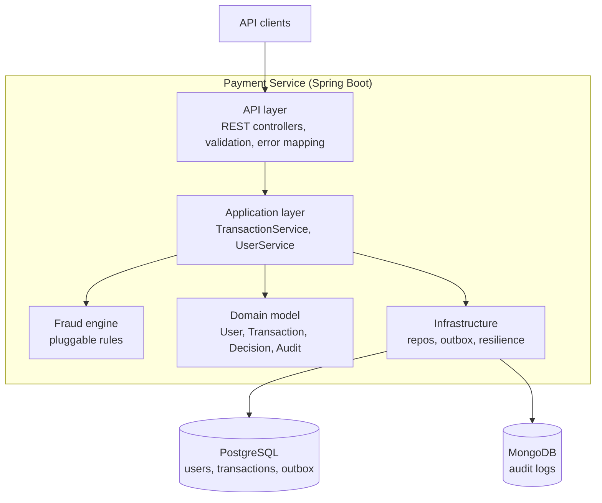
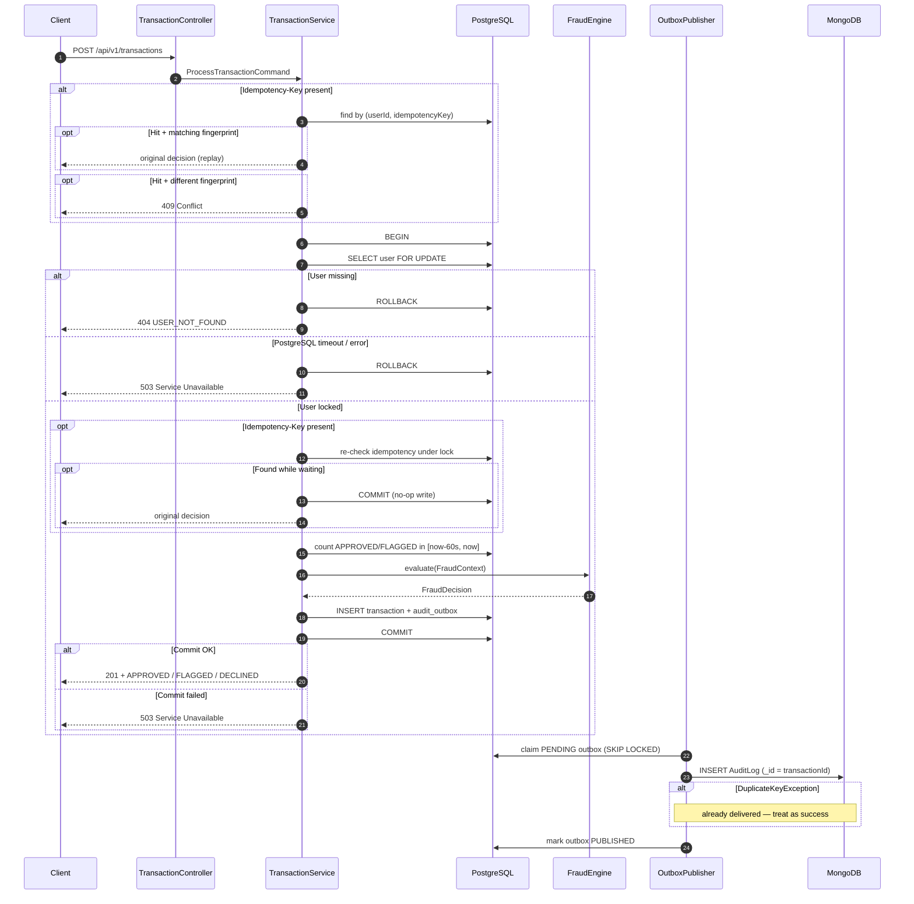
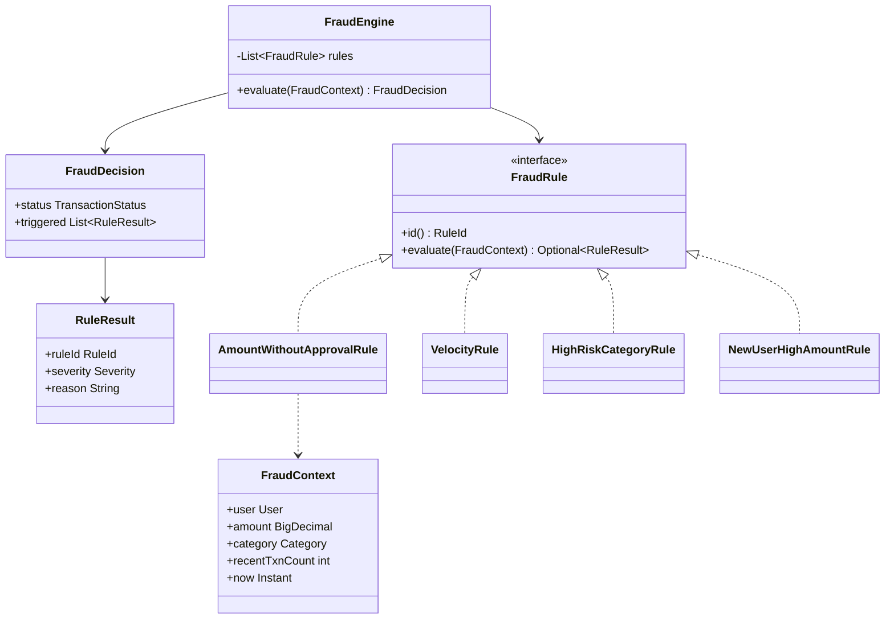
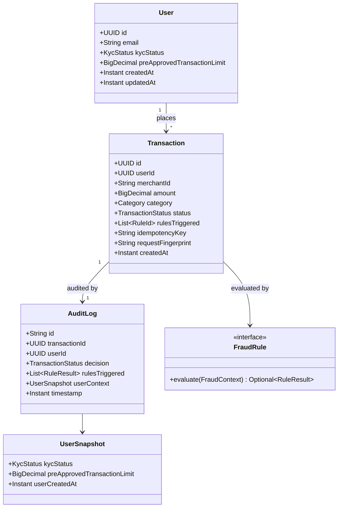
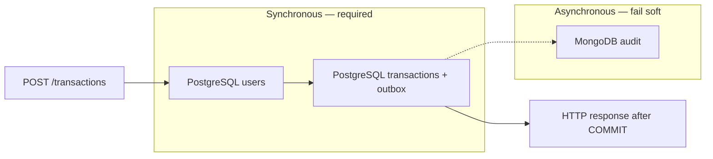
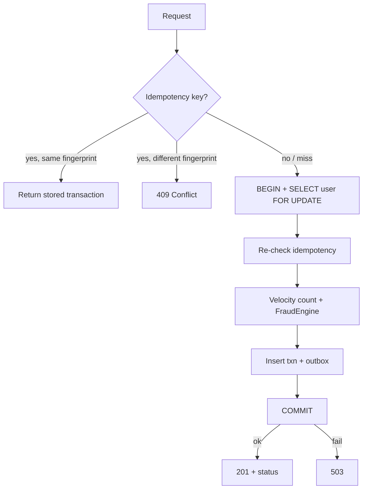
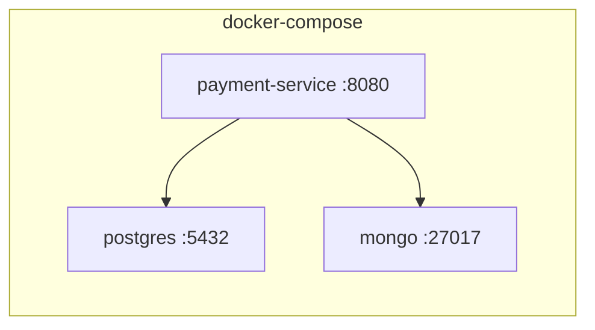

# Payment Processing System — System Design

This document describes the architecture of a payment processing service for a digital bank. The system accepts payment transactions, evaluates them against fraud rules, records an immutable audit trail, and exposes user-management APIs.

The design is sized for a single Spring Boot service with PostgreSQL and MongoDB, runnable via Docker Compose. Choices below favor correctness, testability, and explainability over architectural decoration.

**Core guarantee:** No transaction decision is acknowledged to the client unless the transaction and its audit intent have been durably committed to PostgreSQL.

```text
APPROVED response  → durable APPROVED transaction exists
FLAGGED response   → durable FLAGGED transaction exists
DECLINED response  → durable DECLINED transaction exists
Persistence unavailable → no business decision acknowledged → 503 Service Unavailable
```

---


## 1. Goals and Constraints


### Functional

- Accept a transaction (`amount`, `userId`, `merchantId`, `category`), assign an ID and timestamp, and return `APPROVED`, `FLAGGED`, or `DECLINED`.
- Evaluate four fraud rules on every request (all rules run; results are aggregated).
- Persist an audit record for every decision (rules triggered, timestamp, user context). Audit data must survive restarts.
- Manage users: creation date, KYC status, pre-approved transaction limits; CRUD-style REST APIs.


### Non-functional

- Concurrent requests for the same user must not bypass velocity limits.
- Downstream slowness or outage must not lose transaction data or audit intent.
- Layered, testable Java (Spring Boot 3.x, Maven, JUnit 5, Testcontainers, JaCoCo ≥ 75%).
- Structured logging (SLF4J / Logback). Observable HTTP API (OpenAPI).


### Explicit assumptions

These are not specified in the brief; they are called out so behavior is deterministic:


| Topic                  | Assumption                                                                                                                                            |
| ---------------------- | ----------------------------------------------------------------------------------------------------------------------------------------------------- |
| Currency               | Single currency (`SAR`). Amounts stored as `NUMERIC(19,4)`.                                                                                           |
| Isolation              | PostgreSQL `READ COMMITTED` plus targeted `SELECT … FOR UPDATE` on the user row. No need for global `SERIALIZABLE`.                                   |
| Velocity window        | **Sliding** 60-second window: `[now - 60s, now]` inclusive. Not fixed clock-minute buckets.                                                           |
| Velocity counting      | Count only `APPROVED` and `FLAGGED`. **Declined** attempts are **not** counted.                                                                       |
| Velocity threshold     | Before processing: if `recentCount >= 3`, decline. The incoming request would be the 4th authorized transaction.                                      |
| Rule composition       | All rules run. Any `DECLINE` wins over `FLAG`. Otherwise `FLAG` wins over `APPROVED`.                                                                 |
| High-risk categories   | `GAMBLING`, `CRYPTO`, `CASH_ADVANCE`, `ADULT`. Extensible via config.                                                                                 |
| KYC                    | Stored and included in audit context. **No** transaction decision is based on KYC — the challenge defines no KYC-specific fraud rule.                 |
| Missing user           | Unknown `userId` is a client error (`404`), not a fraud decline.                                                                                      |
| PostgreSQL unavailable | Return `503 Service Unavailable`. Do **not** approve and do **not** fabricate a fraud `DECLINED`. Infrastructure failure ≠ business decline.          |
| Idempotency            | Optional `Idempotency-Key` header. Same key + same request fingerprint → original result. Same key + different fingerprint → `409`.                   |
| Declined HTTP status   | `DECLINED` returns `201 Created` — the transaction resource was successfully processed and persisted. Business outcome is in the body `status` field. |


---


## 2. High-Level Architecture

The product is one bounded context: **payment authorization with fraud screening**. It is deployed as one Spring Boot application plus two data stores.




### Main components


| Component               | Responsibility                                                                                                                                  |
| ----------------------- | ----------------------------------------------------------------------------------------------------------------------------------------------- |
| **API layer**           | HTTP contracts, request validation, status-code mapping, OpenAPI. No business rules.                                                            |
| **Transaction service** | Orchestrates one payment: idempotency, per-user row lock, load user, run fraud, persist transaction + outbox, return decision **after commit**. |
| **User service**        | Create / read / update user profiles used by fraud (KYC, created-at, pre-approved limit).                                                       |
| **Fraud engine**        | Evaluates all `FraudRule` implementations against a `FraudContext`. Returns a `FraudDecision`.                                                  |
| **PostgreSQL**          | Source of truth for users and transactions. Also holds the audit **outbox** so nothing is lost if Mongo is down.                                |
| **MongoDB**             | Query-optimized, append-only audit collection. Eventually consistent with PostgreSQL.                                                           |
| **Outbox publisher**    | Background worker that ships committed outbox rows to Mongo and retries on failure (`FOR UPDATE SKIP LOCKED`).                                  |
| **Resilience**          | Timeouts and circuit breakers around Mongo. PostgreSQL failures surface as `503`.                                                               |


PostgreSQL is the **system of record**. MongoDB is an **audit projection**. A decision is durable as soon as the PostgreSQL transaction commits, even if Mongo is unavailable.

**Why MongoDB at all?** PostgreSQL alone could store both transactions and audit records atomically and would be simpler for this scope. MongoDB is deliberately used as a separate audit projection to demonstrate resilience and consistency across heterogeneous stores. PostgreSQL remains authoritative through the transactional outbox.

---


## 3. Layered Design (Inside the Service)

Pragmatic ports-and-adapters layout. Interfaces exist where they protect boundaries — not for every class.

```
com.paymentprocessing
├── api
│   ├── controller
│   ├── dto
│   └── error
├── application
│   ├── service          # TransactionService, UserService
│   └── port
│       ├── in
│       └── out
├── domain
│   ├── model            # User, Transaction, Category, KycStatus, …
│   └── fraud
│       └── rules        # one class per rule
├── infrastructure
│   ├── postgres
│   ├── mongo
│   └── outbox
└── config
```

**Dependency rule:** `api` → `application` → `domain`. `infrastructure` implements ports defined in `application`/`domain`. Domain has no Spring or JDBC types.

Fraud rules are unit-testable with plain objects. Controllers stay free of persistence and locking details. Prefer interfaces over inheritance; do not introduce abstract base classes unless subclasses share real invariant behavior.

---


## 4. Request Flow — Process Transaction




### Processing steps (happy path)

1. Validate payload (amount > 0, required IDs, known category).
2. If an idempotency key is present, look up by `(userId, key)`. Matching fingerprint → return stored result. Different fingerprint → `409`.
3. `BEGIN` a PostgreSQL transaction.
4. `SELECT * FROM users WHERE id = :userId FOR UPDATE` — serialization point for that user.
5. Re-check idempotency under the lock (another request may have inserted while waiting).
6. Query velocity: count `APPROVED`/`FLAGGED` in the sliding window `[now - 60s, now]`.
7. Build `FraudContext` and evaluate **all** fraud rules.
8. Insert `transactions` and `audit_outbox` in the **same** transaction.
9. `COMMIT`. Only then return `201` with the business `status`.
10. If commit fails → `ROLLBACK` → `503`. No decision is acknowledged.
11. The publisher writes the audit document to Mongo asynchronously.


### Transaction boundary

```text
BEGIN
  ↓
SELECT user FOR UPDATE
  ↓
Load authoritative user data
  ↓
Re-check idempotency
  ↓
Query APPROVED/FLAGGED in [now - 60s, now]
  ↓
Evaluate fraud rules
  ↓
Insert transaction
  ↓
Insert audit outbox
  ↓
COMMIT
  ↓
Return APPROVED / FLAGGED / DECLINED
```

The `FOR UPDATE` lock is held until commit or rollback, so another request for the same user cannot run the velocity check before the previous transaction is visible.

### Decision acknowledgement

```text
Evaluate fraud decision
        ↓
Persist transaction
        ↓
Persist audit outbox
        ↓
COMMIT PostgreSQL transaction
        ↓
Return APPROVED / FLAGGED / DECLINED
```

If the PostgreSQL commit fails:

```text
ROLLBACK
   ↓
503 Service Unavailable
```

The client is not blocked on Mongo. Audit intent cannot disappear on restart because it lives in `audit_outbox` until Mongo ACK.

---


## 5. Fraud Detection Engine


### Why a dedicated engine (not inline `if`s in the service)

Putting rules in `TransactionService` would mix orchestration with policy and make Rule 4 (flag-but-allow) easy to get wrong when combined with declines.

Rules live in a **small in-process engine**:

- `FraudRule` — one class per rule, independently unit-tested.
- `FraudEngine` — runs all rules, aggregates by severity.
- `FraudContext` — immutable snapshot (user, amount, category, velocity count, clock).
- No I/O inside a rule. The service gathers data; the engine only decides.

Do **not** introduce Drools or an external rules engine for four fixed rules. Adding a fifth rule is a new class plus registration.




### Aggregation / precedence

```
severity(DECLINE) > severity(FLAG) > severity(ALLOW)

if any rule returns DECLINE → TransactionStatus.DECLINED
else if any rule returns FLAG    → TransactionStatus.FLAGGED
else                             → TransactionStatus.APPROVED
```

All rules always run. Example: amount `12000`, category `CRYPTO`, user age 10 days can trigger `AMOUNT_WITHOUT_APPROVAL` (DECLINE), `HIGH_RISK_CATEGORY` (DECLINE), and `NEW_USER_HIGH_AMOUNT` (FLAG). Final decision is `DECLINED`; audit still contains all three triggered rules.

`FLAGGED` is a **successful** authorization that requires review. The transaction is stored and the client receives `201`.

### Rules


| ID                        | Condition                                                                                                  | Outcome   |
| ------------------------- | ---------------------------------------------------------------------------------------------------------- | --------- |
| `AMOUNT_WITHOUT_APPROVAL` | `amount > 10_000` **and** `amount > user.preApprovedTransactionLimit` (`null` or `0` = no prior approval)  | `DECLINE` |
| `VELOCITY`                | count of this user's `APPROVED`**/**`FLAGGED` rows with `created_at` in `[now - 60s, now]` **already ≥ 3** | `DECLINE` |
| `HIGH_RISK_CATEGORY`      | category ∈ high-risk set **and** `amount > 5_000`                                                          | `DECLINE` |
| `NEW_USER_HIGH_AMOUNT`    | `amount > 5_000` **and** `user.createdAt > now - 30 days` (user younger than 30 days)                      | `FLAG`    |


`preApprovedTransactionLimit` is the “prior user approval” from Rule 1. Operations raises it via `PATCH /users/{id}` after an offline approval. A limit of `15000` allows a `12000` payment and still declines `16000`.

High-risk categories are a Spring `@ConfigurationProperties` set so they can change without a code edit.

### Clock

Rules use a `Clock` bean (`Clock.systemUTC()` in prod, fixed clock in tests) so 30-day and 60-second windows are deterministic.

---


## 5.1 Rule 2 — Velocity (authoritative definition)

> **For each incoming transaction, evaluate a sliding 60-second window from** `now - 60 seconds` **through** `now`**, inclusive. Count only previously persisted transactions for the same user whose status is** `APPROVED` **or** `FLAGGED`**. If three or more qualifying transactions already exist, the incoming transaction is declined. Concurrent requests for the same user are serialized using** `SELECT … FOR UPDATE` **on the user row, with the lock, velocity query, fraud evaluation, transaction insert, and audit-outbox insert occurring inside the same PostgreSQL transaction.**


### Sliding window (not fixed buckets)

```text
windowStart = currentTransactionTime - 60 seconds
evaluate transactions in [windowStart, now]
```

Example: new transaction at `12:01:10` → window `12:00:10` … `12:01:10`.

Not clock-minute buckets such as `12:00:00 → 12:00:59`.

### Inclusive time boundary

```sql
created_at >= :windowStart   -- windowStart = now - 60 seconds
AND created_at <= :now
```

A row exactly at `now - 60s` **is** counted. A row at `now - 60s - 1ms` is **not**.

### Counting semantics

Count only successful authorization outcomes:

```text
APPROVED, FLAGGED   → counted
DECLINED            → not counted
```

Example history in-window: `APPROVED`, `APPROVED`, `DECLINED`, `FLAGGED` → Rule 2 count is **3**, not 4. A declined attempt does not extend the velocity block.

### Reference query

```sql
SELECT COUNT(*)
FROM transactions
WHERE user_id = :userId
  AND status IN ('APPROVED', 'FLAGGED')
  AND created_at >= :windowStart
  AND created_at <= :now;
```


### Threshold

```java
if (recentCount >= 3) {
    return RuleResult.decline(RuleId.VELOCITY);
}
```

Example: `T1=12:00:20`, `T2=12:00:35`, `T3=12:00:50`, new request `12:01:00` → `recentCount = 3` → incoming would be #4 → `DECLINE`.

### Concurrency protection

```sql
SELECT *
FROM users
WHERE id = :userId
FOR UPDATE;
```

```text
Request A                         Request B
SELECT USER FOR UPDATE
acquires lock
                                  SELECT USER FOR UPDATE
                                  waits
count recent = 2
process transaction #3
commit / release lock
                                  acquires lock
                                  count recent = 3
                                  transaction #4 DECLINED
                                  commit
```

Different users lock different rows and proceed concurrently.

---


## 6. Domain Model




### Enumerations

- `TransactionStatus`: `APPROVED` | `FLAGGED` | `DECLINED`
- `KycStatus`: `PENDING` | `VERIFIED` | `REJECTED`
- `Category`: `GROCERIES`, `TRAVEL`, `ELECTRONICS`, `GAMBLING`, `CRYPTO`, `CASH_ADVANCE`, `MONEY_TRANSFER`, `ADULT`, `OTHER`
- `Severity`: `ALLOW` | `FLAG` | `DECLINE`
- `OutboxStatus`: `PENDING` | `PUBLISHED`

`UserSnapshot` is copied into the audit document at decision time so later KYC or limit changes do not rewrite history. KYC is audit context only — no fraud rule reads it.

---


## 7. Data Design


### PostgreSQL (system of record)

Isolation level: `READ COMMITTED`. Per-user invariants are protected by `SELECT … FOR UPDATE` on the user row, not by raising isolation globally.

`users`


| Column                           | Type                   | Notes                                 |
| -------------------------------- | ---------------------- | ------------------------------------- |
| `id`                             | `UUID PK`              |                                       |
| `email`                          | `TEXT UNIQUE NOT NULL` |                                       |
| `kyc_status`                     | `TEXT NOT NULL`        | Audit / profile only                  |
| `pre_approved_transaction_limit` | `NUMERIC(19,4)`        | `NULL` = no high-value prior approval |
| `created_at`                     | `TIMESTAMPTZ NOT NULL` | Used by Rule 4                        |
| `updated_at`                     | `TIMESTAMPTZ NOT NULL` |                                       |


`transactions`


| Column                | Type                       | Notes                                               |
| --------------------- | -------------------------- | --------------------------------------------------- |
| `id`                  | `UUID PK`                  | Returned to the client                              |
| `user_id`             | `UUID NOT NULL FK → users` |                                                     |
| `merchant_id`         | `TEXT NOT NULL`            | Opaque merchant identifier                          |
| `amount`              | `NUMERIC(19,4) NOT NULL`   | `CHECK (amount > 0)`                                |
| `category`            | `TEXT NOT NULL`            |                                                     |
| `status`              | `TEXT NOT NULL`            | APPROVED / FLAGGED / DECLINED                       |
| `rules_triggered`     | `TEXT[]`                   | Rule IDs                                            |
| `idempotency_key`     | `TEXT`                     | Nullable                                            |
| `request_fingerprint` | `TEXT`                     | SHA-256 of canonical payload; used with idempotency |
| `created_at`          | `TIMESTAMPTZ NOT NULL`     | Decision time; velocity window                      |


Indexes:

```sql
CREATE INDEX idx_transaction_user_created
ON transactions(user_id, created_at DESC);

-- Optional; helpful when filtering by status for Rule 2
CREATE INDEX idx_transaction_user_status_created
ON transactions(user_id, status, created_at DESC);

CREATE UNIQUE INDEX idx_transaction_user_idempotency
ON transactions(user_id, idempotency_key)
WHERE idempotency_key IS NOT NULL;
```

The simpler `(user_id, created_at)` index is sufficient at challenge scale. The unique partial index is the final idempotency invariant.

`audit_outbox`


| Column            | Type                     | Notes                        |
| ----------------- | ------------------------ | ---------------------------- |
| `id`              | `BIGSERIAL PK`           |                              |
| `transaction_id`  | `UUID NOT NULL UNIQUE`   |                              |
| `payload`         | `JSONB NOT NULL`         | Full audit document          |
| `status`          | `TEXT NOT NULL`          | `PENDING` / `PUBLISHED` only |
| `attempts`        | `INT NOT NULL DEFAULT 0` |                              |
| `last_error`      | `TEXT`                   | Last publish failure message |
| `next_attempt_at` | `TIMESTAMPTZ NOT NULL`   | Exponential backoff          |
| `created_at`      | `TIMESTAMPTZ NOT NULL`   |                              |


```sql
CREATE INDEX idx_audit_outbox_pending
ON audit_outbox(status, next_attempt_at);
```

No terminal `FAILED` state that silently stops delivery. Events are retained; backoff grows; metrics and alerts fire. If a dead-letter path is added later, the original payload remains durable and recoverable.

The outbox row is inserted in the **same** database transaction as the payment row (transactional outbox).

### Database constraints (defense in depth)

API validation gives good client errors; constraints protect invariants:

- `CHECK (amount > 0)`
- `NOT NULL` on required fields
- `UNIQUE users.email`
- `UNIQUE (user_id, idempotency_key) WHERE idempotency_key IS NOT NULL`
- `UNIQUE audit_outbox.transaction_id`


### MongoDB (audit projection)

Collection `audit_logs` — **append-only**. Existing audit records are **never overwritten**. Corrections, if ever needed, are additional events.

```json
{
  "_id": "txn-uuid",
  "transactionId": "txn-uuid",
  "userId": "user-uuid",
  "decision": "FLAGGED",
  "rulesTriggered": [
    { "ruleId": "NEW_USER_HIGH_AMOUNT", "severity": "FLAG", "reason": "..." }
  ],
  "userContext": {
    "kycStatus": "VERIFIED",
    "preApprovedTransactionLimit": 0,
    "userCreatedAt": "2026-08-20T10:00:00Z"
  },
  "amount": "6200.00",
  "merchantId": "m_123",
  "category": "ELECTRONICS",
  "timestamp": "2026-09-10T16:01:02Z"
}
```

Publishing uses **immutable insert** with `_id = transactionId`. On retry, `DuplicateKeyException` means the audit was already persisted — treat as success and mark outbox `PUBLISHED`. Do not upsert/rewrite history.

Indexes: `{ userId: 1, timestamp: -1 }`, `{ decision: 1, timestamp: -1 }`.

### Schema migrations

**Flyway** only (not Liquibase):

```text
V1__create_users.sql
V2__create_transactions.sql
V3__create_audit_outbox.sql
```

---


## 8. API Design

Base path: `/api/v1`. JSON. `X-Request-Id` echoed on every response.

### Transactions

`POST /api/v1/transactions`

Headers: optional `Idempotency-Key`.

```json
{
  "amount": 6200.00,
  "userId": "3fa85f64-5717-4562-b3fc-2c963f66afa6",
  "merchantId": "mch_9f2",
  "category": "ELECTRONICS"
}
```


| Outcome                                 | HTTP          | Body `status`                        |
| --------------------------------------- | ------------- | ------------------------------------ |
| Processed (any business outcome)        | `201 Created` | `APPROVED`, `FLAGGED`, or `DECLINED` |
| Unknown user                            | `404`         | —                                    |
| Same idempotency key, different payload | `409`         | —                                    |
| Malformed request                       | `400`         | —                                    |
| PostgreSQL unavailable / commit failed  | `503`         | —                                    |


All three business statuses return `201` because each represents a successfully evaluated and **persisted** transaction resource. The authorization outcome lives in `status`. `DECLINED` means the **business** rejected the payment — not that the HTTP request failed.

```json
{
  "transactionId": "7c9e6679-7425-40de-944b-e07fc1f90ae7",
  "status": "DECLINED",
  "amount": 12000.00,
  "rulesTriggered": ["HIGH_RISK_CATEGORY"],
  "createdAt": "2026-09-10T16:01:02Z"
}
```

`FLAGGED` example:

```json
{
  "transactionId": "7c9e6679-7425-40de-944b-e07fc1f90ae7",
  "status": "FLAGGED",
  "amount": 6200.00,
  "rulesTriggered": ["NEW_USER_HIGH_AMOUNT"],
  "createdAt": "2026-09-10T16:01:02Z"
}
```

`GET /api/v1/transactions/{id}` — fetch a stored decision (useful for idempotent clients and ops).

### Infrastructure failure vs business decline

**Business decline**

```text
Authoritative data loaded successfully
        ↓
Fraud engine evaluated transaction
        ↓
A DECLINE rule triggered
        ↓
Transaction persisted as DECLINED
        ↓
201 + status DECLINED
```

**Infrastructure failure**

```text
PostgreSQL unavailable or commit fails
        ↓
Transaction could not be safely evaluated/persisted
        ↓
503 Service Unavailable
```

`DECLINED` = the business rejected the transaction. `503` = the system could not safely reach or durably store a business decision. Never fabricate a fraud decline for an infrastructure outage.

### Users


| Method  | Path                 | Purpose                                         |
| ------- | -------------------- | ----------------------------------------------- |
| `POST`  | `/api/v1/users`      | Create user (sets `createdAt`)                  |
| `GET`   | `/api/v1/users/{id}` | Query profile                                   |
| `PATCH` | `/api/v1/users/{id}` | Update KYC and/or `preApprovedTransactionLimit` |


Create body: `{ "email", "kycStatus"? }`. Default KYC `PENDING`, `preApprovedTransactionLimit` null.

### Idempotency

Do **not** compare raw JSON strings. Store a deterministic request fingerprint from canonical business fields:

```text
SHA-256(canonical(userId, merchantId, amount, category))
```

| Same key + same fingerprint | Return original transaction |
| Same key + different fingerprint | `409 Conflict` |

Application checks (before and after acquiring the user lock) provide friendly handling. The unique DB constraint is the final correctness guarantee:

> Application logic provides friendly handling; database constraints protect invariants.

Recommended sequence:

```text
1. Lookup existing transaction using userId + Idempotency-Key
2. If found and fingerprint matches → return original result
3. If found and fingerprint differs → 409
4. Acquire user row with SELECT … FOR UPDATE
5. Check idempotency again
6. If another request created it while waiting → return it
7. Otherwise process normally
```

---


## 9. Design Decisions and Trade-offs


### 9.1 Where fraud rules live

**Choice:** In-process strategy objects behind `FraudEngine`. One class per rule; interface only — no unnecessary abstract base classes.


| Option                            | Pros                                    | Cons                                      |
| --------------------------------- | --------------------------------------- | ----------------------------------------- |
| `if`/`else` in the service        | Fast to write                           | Untestable in isolation; composition bugs |
| Rules engine (Drools, etc.)       | Hot-reload policies                     | Heavy for four static rules               |
| **Java** `FraudRule` **+ engine** | Unit-testable, explicit, easy to extend | Code change to add a rule                 |


### 9.2 Audit: sync vs async

**Choice:** **Transactional outbox** — synchronous durability in PostgreSQL, asynchronous projection to MongoDB.


| Option                             | Durability              | Latency               | Failure mode                                            |
| ---------------------------------- | ----------------------- | --------------------- | ------------------------------------------------------- |
| Sync write to Mongo in the request | Strong if both succeed  | Client waits on Mongo | Dual-write: PG committed, Mongo failed (or the reverse) |
| Fire-and-forget to Mongo           | Weak                    | Fast                  | Lost on crash before send                               |
| **Outbox in the PG transaction**   | Strong for the decision | Fast for the client   | Mongo lags; publisher retries                           |


Mongo is **not** on the synchronous authorization path:

```text
Transaction request
       ↓
PostgreSQL transaction + outbox
       ↓
COMMIT
       ↓
Return business decision

Mongo publishing occurs asynchronously
```

If MongoDB is unavailable: processing continues, outbox stays `PENDING`, publisher retries, audit is eventually inserted. No transaction data or audit intent is lost.

### 9.3 Concurrency and Rule 2

**Race:** two concurrent payments for the same user both read `count = 2`, both approve → four authorized payments in 60 seconds.

**Choice:** `SELECT * FROM users WHERE id = :userId FOR UPDATE` held for the entire velocity + insert transaction.

- Serializes only **that user**. Other users proceed in parallel.
- Lock is transaction-scoped; releases on commit/rollback.
- Works across multiple app instances sharing one Postgres.
- An application-level mutex is **not** enough across instances.

Idempotency is a separate unique constraint, not a substitute for the velocity lock.

### 9.4 Consistency between PostgreSQL and MongoDB

This is **at-least-once, eventually consistent** replication:

1. PG commit is atomic (transaction + outbox).
2. Publisher **inserts** Mongo with `_id = transactionId`, then marks `PUBLISHED`.
3. Crash between Mongo insert and outbox update → retry; `DuplicateKeyException` → already delivered → mark `PUBLISHED`.
4. Crash before Mongo write → retry from outbox; no silent loss.

There is no two-phase commit. We accept a short window where PG is ahead of Mongo.

### 9.5 Outbox publisher

**Multi-instance safety** — claim rows with:

```sql
SELECT *
FROM audit_outbox
WHERE status = 'PENDING'
  AND next_attempt_at <= now()
ORDER BY id
FOR UPDATE SKIP LOCKED
LIMIT :batchSize;
```

Workers process disjoint batches without blocking each other.

**Retry policy** — persistent retries with configurable exponential backoff (example: immediate, +2s, +5s, +10s, +30s, …). After repeated failures: retain the event, increase intervals, emit metrics, alert ops. Never silently discard.

### 9.6 Resilience and graceful degradation




| Dependency                | Policy                                                                                                                                                        |
| ------------------------- | ------------------------------------------------------------------------------------------------------------------------------------------------------------- |
| PostgreSQL (users / txns) | JDBC timeout (e.g. 2s). If user load or commit fails: `503`. No fabricated `DECLINED`. Nothing acknowledged unless committed.                                 |
| MongoDB                   | Not on the request path. Publisher: timeout, circuit breaker (Resilience4j), exponential backoff. Circuit open → skip poll briefly, outbox remains `PENDING`. |
| Process crash             | In-flight HTTP may return 5xx; if PG committed, the decision and outbox are intact. Client retries with the same idempotency key.                             |


---


## 10. Concurrency, Idempotency, and Time




- **Velocity** uses inclusive `[now - 60s, now]` on `APPROVED`/`FLAGGED` only, under the same user-row lock as the insert.
- **Time** is `Instant.now(clock)` applied as `created_at` for both the row and the 60s/30d windows — one timestamp per request.
- **Idempotency** unique index prevents double-insert if two retries overlap; the loser re-reads the winner’s row.

---


## 11. Observability

Structured logs (JSON via Logback), fields: `requestId`, `transactionId`, `status`, `rulesTriggered`, `durationMs`. Log user identifiers only per privacy policy. Do **not** log credentials, tokens, or full sensitive financial information.

Metrics:


| Metric                               | Purpose                           |
| ------------------------------------ | --------------------------------- |
| `payment.transactions.total{status}` | Throughput by outcome             |
| `fraud.rule.triggered{rule}`         | Which rules fire                  |
| `payment.processing.duration`        | End-to-end latency                |
| `velocity.lock.wait`                 | User-row lock contention          |
| `outbox.pending.count`               | Backlog size                      |
| `outbox.oldest.pending.age`          | How far Mongo audit lag has grown |
| `outbox.publish.failures`            | Publish errors                    |
| `mongo.publish.duration`             | Publisher latency                 |


Health (Spring Actuator):

- **Liveness** = process healthy.
- **Readiness** = PostgreSQL up (required to safely process payments).
- Mongo down → still **READY** but degraded (async audit projection only).

---


## 12. Deployment Topology




- One `docker-compose.yml`: app, PostgreSQL, MongoDB.
- App waits for PG via healthchecks, then **Flyway** migrations, then starts.
- Outbox publisher is a `@Scheduled` worker **inside** the app (safe across instances via `SKIP LOCKED`).

**Out of scope for this challenge:** Kafka / Zookeeper / KRaft, Redis for velocity or distributed locks, microservices, Drools, event sourcing, separate fraud or audit services. PostgreSQL outbox + scheduled publisher is sufficient. Kafka could be introduced later for many downstream consumers; Redis would add consistency concerns without being necessary for Rule 2.

---


## 13. Testing Strategy (mapped to this design)

Use **Testcontainers** (PostgreSQL + MongoDB), not H2 — the design depends on `FOR UPDATE`, `SKIP LOCKED`, partial indexes, and `TIMESTAMPTZ`.


| Layer       | What                                                                                                                                                                  | How                                |
| ----------- | --------------------------------------------------------------------------------------------------------------------------------------------------------------------- | ---------------------------------- |
| Domain      | Each `FraudRule`; aggregation (no rules → APPROVED, FLAG only, DECLINE only, FLAG+DECLINE → DECLINED, multiple DECLINEs); Rule 2 inclusive 60s edge; Rule 4 age edges | JUnit 5, fixed `Clock`, no Spring  |
| Application | Lock → re-check idempotency → engine → persist outbox; `503` on PG failure; fingerprint conflict                                                                      | Mockito on ports                   |
| Persistence | Unique idempotency, velocity query, outbox insert with txn rollback                                                                                                   | Testcontainers PostgreSQL          |
| Audit       | Insert + DuplicateKey = already delivered; Mongo outage → PENDING → recover → PUBLISHED                                                                               | Testcontainers Mongo (+ PG)        |
| API         | `201` (all statuses) / `404` / `409` / `503`                                                                                                                          | `@SpringBootTest` + Testcontainers |


### Concurrency regression (Rule 2 + lock)

**Incorrect:** three existing qualifying transactions + two concurrent requests (both already violate Rule 2).

**Correct:**

```text
2 existing APPROVED/FLAGGED transactions
+
2 simultaneous requests
```

Expected: Request A sees `recentCount = 2` → may `APPROVED`/`FLAGGED` as #3. Request B then sees `recentCount = 3` → `DECLINED` as #4.

Assertion: exactly one may be `APPROVED`/`FLAGGED`; exactly one is `DECLINED` by Rule 2.

### Idempotency tests

- Same key + same fingerprint → original `T1`; no second transaction, no second outbox, no extra Rule 2 count.
- Same key + different payload → `409`.
- Concurrent duplicates with same key → exactly one transaction, one outbox event, both resolve to the same result.


### Time-boundary tests (injected `Clock`)

- Rule 2: transaction exactly 60 seconds old → **counted** (`created_at >= now - 60s`).
- Rule 2: 60 seconds + 1 ms old → **not** counted.
- Rule 4: user exactly 30 days old, younger than 30 days, older than 30 days — document inclusive/exclusive consistently with `user.createdAt > now - 30 days` (exactly 30 days old → **not** flagged).


### Outbox tests

- Mongo available → audit inserted → outbox `PUBLISHED`.
- Mongo unavailable → transaction still commits → outbox `PENDING` → Mongo restored → publisher retries → insert → `PUBLISHED`.
- Ambiguous retry: Mongo insert succeeded but outbox not marked → retry → duplicate `_id` → treat as delivered → mark `PUBLISHED`.

---


## 14. Optional Enhancements (how they fit)

Designed as additive; not required for the core path.


| Enhancement      | Fit                                                                                                                                       |
| ---------------- | ----------------------------------------------------------------------------------------------------------------------------------------- |
| Idempotency keys | Included in the core design (header + fingerprint + unique index).                                                                        |
| Webhooks         | Outbox payload can grow a `WEBHOOK` destination; same publisher pattern.                                                                  |
| Rate limiting    | HTTP-level (Bucket4j / gateway) **in addition to** Rule 2. Rule 2 is a fraud control, not a DoS shield.                                   |
| Bulk export      | `GET /transactions?userId&from&to&cursor=` against PostgreSQL; audit export from Mongo.                                                   |
| User cache       | Short-TTL cache of `User` by id is optional. **Do not** move velocity counts or locking to Redis — PG remains source of truth for Rule 2. |
| SonarQube        | CI-only; no runtime impact.                                                                                                               |


---


## 15. What we would not do (for this scope)

- **Two-phase commit** between PG and Mongo.
- **Approve when the user record cannot be read** — or fabricate a fraud `DECLINED` for infrastructure failure (`503` instead).
- **Acknowledge a decision before PostgreSQL commit.**
- **In-memory-only audit.** It dies with the process.
- **Overwrite Mongo audit documents** (upsert rewriting history).
- **Terminal outbox** `FAILED` **that silently stops delivery.**
- **Kafka, Redis distributed locks, Drools, microservices, event sourcing** for this challenge size.
- **Global synchronized lock** or raising the whole DB to `SERIALIZABLE`.
- **A separate microservice per rule.**

---


## 16. Implementation Sequence

Aligned with the challenge’s suggested order:

1. Docker Compose + Flyway schema (users, transactions, outbox) + Mongo collection.
2. Domain model + `FraudEngine` and four rules with unit tests (including aggregation and time boundaries).
3. `TransactionService` with `SELECT … FOR UPDATE`, double idempotency check, and outbox write inside one PG transaction.
4. User APIs (`preApprovedTransactionLimit`, KYC).
5. Outbox publisher (`SKIP LOCKED`, insert-or-duplicate-key, exponential backoff) + Mongo.
6. API layer (`201` for all business statuses, `503` for PG failures), OpenAPI, structured logging, metrics.
7. Integration tests (Testcontainers), JaCoCo, README (include the core guarantee and Mongo justification).

This order keeps the fraud policy correct before HTTP and storage adapters accumulate around it.