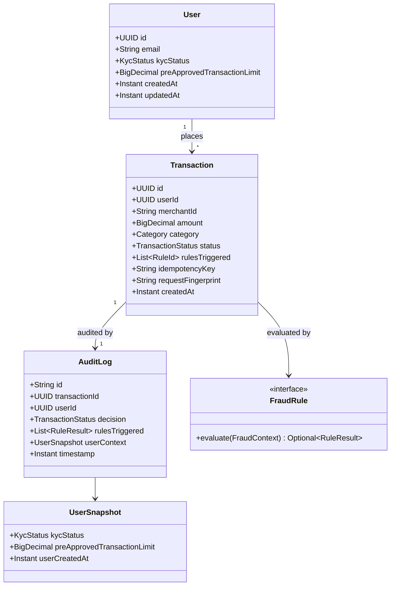

# Domain UML — Payment Processing System

Canonical domain model from [low-level-design.md](low-level-design.md). Also embedded in the root [README](../README.md).

**Enumerations:** `TransactionStatus` (`APPROVED` | `FLAGGED` | `DECLINED`), `KycStatus`, `Category`, `Severity`, `OutboxStatus`.

`UserSnapshot` is copied into the Mongo audit document at decision time so later KYC/limit changes do not rewrite history.
